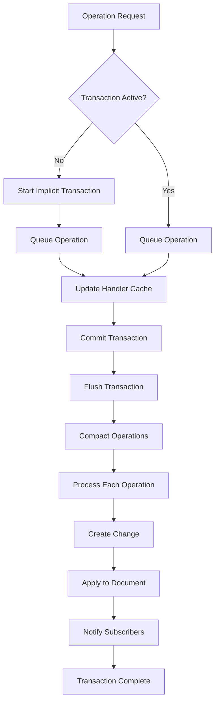
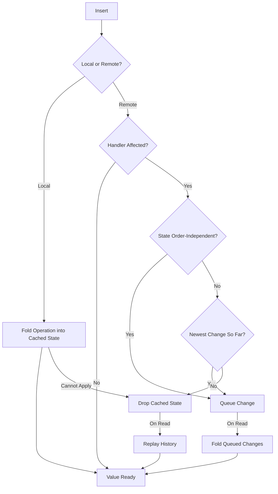
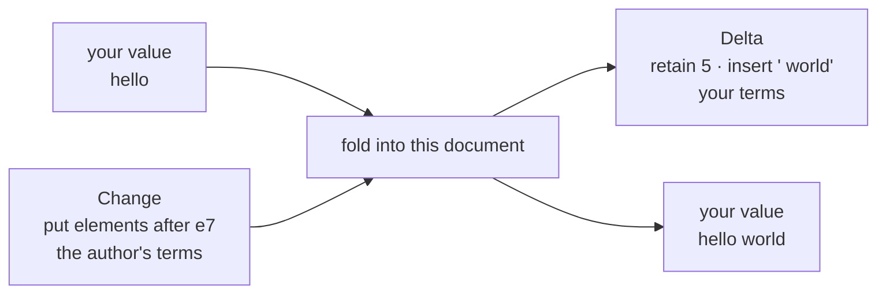
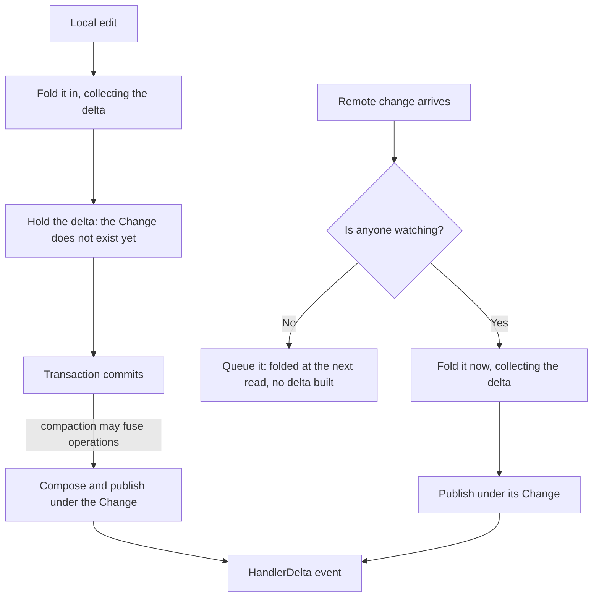
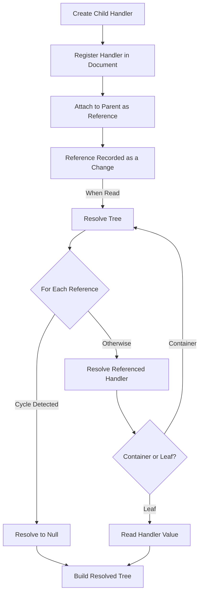

# CRDT LF

[![crdt_lf_badge][crdt_lf_badge]][pub_link]
[![pub points][pub_points]][pub_link]
[![pub likes][pub_likes]][pub_link]
[![codecov][codecov_badge]][codecov_link]
[![ci_badge][ci_badge]][ci_link]
[![License: MIT][license_badge]][license_link]
[![pub publisher][pub_publisher]][pub_publisher_link]

[![docs_badge]][docs_link]

- [CRDT LF](#crdt-lf)
  - [Features](#features)
  - [Greyhound Markdown](#greyhound-markdown)
  - [Getting Started](#getting-started)
  - [Usage](#usage)
    - [Basic Usage](#basic-usage)
    - [Dart Distributed Collaboration Example](#dart-distributed-collaboration-example)
    - [Flutter Distributed Collaboration Example](#flutter-distributed-collaboration-example)
  - [Sync](#sync)
  - [Flutter](#flutter)
  - [Persistence](#persistence)
  - [Benchmarks](#benchmarks)
  - [Design](#design)
    - [Operation based](#operation-based)
    - [Transaction](#transaction)
    - [State cache](#state-cache)
    - [Handler deltas](#handler-deltas)
      - [Where a delta comes from](#where-a-delta-comes-from)
      - [Deltas, or the value?](#deltas-or-the-value)
      - [If you write too: your own edit comes back](#if-you-write-too-your-own-edit-comes-back)
        - [Tagging a write](#tagging-a-write)
    - [Undo](#undo)
      - [Driving it](#driving-it)
      - [Leaving other peers alone](#leaving-other-peers-alone)
      - [What is one step](#what-is-one-step)
      - [What is recorded](#what-is-recorded)
      - [What it does not undo](#what-it-does-not-undo)
      - [Which handlers](#which-handlers)
  - [Architecture](#architecture)
    - [CRDTDocument](#crdtdocument)
      - [Identity](#identity)
    - [Handlers](#handlers)
      - [Custom handlers](#custom-handlers)
        - [When to turn `stamped` on](#when-to-turn-stamped-on)
        - [Making a handler undoable](#making-a-handler-undoable)
      - [Text handlers index by rune](#text-handlers-index-by-rune)
      - [Working with Complex Types](#working-with-complex-types)
      - [Nested Structures (Containers and References)](#nested-structures-containers-and-references)
      - [Choosing How to Model Your Data](#choosing-how-to-model-your-data)
        - [Worked example: a TODO list](#worked-example-a-todo-list)
        - [A quick decision guide](#a-quick-decision-guide)
        - [Picking a leaf handler](#picking-a-leaf-handler)
    - [Transaction](#transaction-1)
    - [DAG](#dag)
    - [Change](#change)
    - [Frontiers](#frontiers)
    - [Snapshot](#snapshot)
    - [Binary representation](#binary-representation)
  - [Project Status](#project-status)
    - [Roadmap](#roadmap)
    - [Contributing](#contributing)
  - [Acknowledgments](#acknowledgments)
  - [Apps](#apps)
  - [Packages](#packages)
  - [Migrations](#migrations)
    - [Migrating from 3.x to 4.0](#migrating-from-3x-to-40)


A Conflict-free Replicated Data Type (CRDT) implementation in Dart. 
This library provides solutions for:
- Text Editing.
- List Editing.
- Map Editing.
- Set Editing.
- Nested (recursive) data structures.

Supporting: 
- Fugue Algorithm for Text Editing to minimize interleaving.
- Observed-Removed (OR) for conflict resolution.
- Movable lists that preserve element identity across concurrent reorderings.
- Nested CRDTs via a flat storage of references (model documents, canvases, trees…).

> Beyond each handler's API documentation, see
> [Choosing How to Model Your Data](#choosing-how-to-model-your-data) for
> guidance on **which handlers to pick and how to combine them** to model your
> own document.

## Features

- ⏱️ **Hybrid Logical Clock**: Uses HLC for causal ordering of operations
- 🔄 **Automatic Conflict Resolution**: Automatically resolves conflicts in a CRDT
- 📦 **Local Availability**: Operations are available locally as soon as they are applied
- 🔍 **Handler deltas**: a handler can say **what** each change did to your copy of it, not only that it changed
- ↩️ **Undo**: `CRDTUndoManager` takes back your own edits by writing the opposite operation, and leaves everyone else's work alone

## Greyhound Markdown

A real-time collaborative markdown editor built with `crdt_lf`. Open it on
separate devices, join the same room and edit together — no install needed.

<div align="center">

[](https://mattiapispisa.it/crdt/greyhound_markdown/)

</div>

<div align="center">
  
</div>

Source: [apps/greyhound_markdown](https://github.com/MattiaPispisa/crdt/tree/main/apps/greyhound_markdown).

## Getting Started

Add this to your package's `pubspec.yaml` file:

```yaml
dependencies:
  crdt_lf: ^4.0.0
```

## Usage

### Basic Usage

```dart
import 'package:crdt_lf/crdt_lf.dart';

void main() {
  // Create a new document
  final doc = CRDTDocument(
    peerId: PeerId.parse('45ee6b65-b393-40b7-9755-8b66dc7d0518'),
  );

  // Create a text handler
  final text = CRDTFugueTextHandler(doc, 'text1');

  // Insert text
  text.insert(0, 'Hello');

  // Delete text
  text.delete(0, 2); // Deletes "He"

  // Get current value
  print(text.value); // Prints "llo"
}
```

### [Dart Distributed Collaboration Example](https://github.com/MattiaPispisa/crdt/tree/main/packages/core/crdt_lf/example/main.dart)
### [Flutter Distributed Collaboration Example](https://github.com/MattiaPispisa/crdt/tree/main/packages/core/crdt_lf/flutter_example)

> 🚀 **Try the examples live in your browser — no install needed.**

<div align="center">

[](https://mattiapispisa.it/crdt/examples/)

</div>

<div align="center">
  
</div>

## Sync 
A sync library is available in the [crdt_socket_sync](https://pub.dev/packages/crdt_socket_sync) package. And it's used to synchronize the CRDT state between peers. More info in the [README](https://github.com/MattiaPispisa/crdt/tree/main/packages/core/crdt_socket_sync/README.md) of the sync package.

A flutter example is available in the [flutter_example](https://github.com/MattiaPispisa/crdt/tree/main/packages/core/crdt_socket_sync/flutter_example) and provide a synced version of the  "Flutter Distributed Collaboration" Example. 

<div align="center">

</div>

## Flutter
A companion library, [crdt_lf_flutter](https://pub.dev/packages/crdt_lf_flutter),containing widgets that make it easier to use `crdt_lf` within Flutter systems. 

It provides Flutter reactivity for `crdt_lf`: widgets rebuild when the CRDT state changes, with selectors, a provider and a collaborative text field. More info in the [README](https://github.com/MattiaPispisa/crdt/tree/main/packages/core/crdt_lf_flutter/README.md) of the Flutter package.

## Persistence
Storage is not handled in this library. It lives in
[crdt_lf_persistence](https://pub.dev/packages/crdt_lf_persistence): the storage contract,
`CRDTDocumentPersistence` to keep a document on disk as it changes, and a plain-file store for an
app that wants no database.

Pick a backend by adding the adapter that implements the contract:
- [crdt_lf_hive](https://pub.dev/packages/crdt_lf_hive): adapters and utils for persist data using [Hive](https://pub.dev/packages/hive).
- [crdt_lf_drift](https://pub.dev/packages/crdt_lf_drift): adapters and utils for persist data using [Drift](https://pub.dev/packages/drift).
- [crdt_lf_sqlite](https://pub.dev/packages/crdt_lf_sqlite): adapters and utils for persist data using [sqlite3](https://pub.dev/packages/sqlite3).

Most apps want `CRDTDocumentPersistence` and nothing else:

```dart
final persistence = await CRDTDocumentPersistence.open(document, storage);
```

What follows is what it does for you, and what to write if you keep a copy of the document
somewhere it does not reach.

The document gives a mirror `events`: a stream of the moves of its durable state. A consumer
follows it and writes down what each event reports, so its copy on disk stays current without ever
exporting the document again.

```dart
document.events.listen((event) {
  switch (event) {
    case DocumentChangesApplied():
      storage.saveChanges(event.changes);
    case DocumentSnapshotUpdated():
      storage.saveSnapshot(event.snapshot);
    case DocumentHistoryPruned():
      storage
        ..deleteChanges(event.removed)
        // Their dependencies were rebuilt: the bytes on disk are stale.
        ..saveChanges(event.rewritten);
  }
});
```

`events` is a broadcast stream and nothing is replayed: subscribe before the document is written
to, or the moves before your subscription are lost.

Three events, and what each one is for:

| event | when | what to do with it |
| --- | --- | --- |
| `DocumentChangesApplied` | changes entered the store, one event per batch | append them |
| `DocumentSnapshotUpdated` | `takeSnapshot`, `importSnapshot` or `mergeSnapshot` | store the snapshot |
| `DocumentHistoryPruned` | history was dropped | delete `removed`, write `rewritten` again |

`DocumentChangesApplied.source` says whether the document wrote the changes (`created`) or took them
in (`ingested`). A mirror saves both; a sync client sends only the first, which is what
`localChanges` already hands it.

Every event also carries the `origin` of the call behind it — `takeSnapshot`, `importSnapshot`,
`mergeSnapshot`, `import` and `garbageCollect` all take one. That is how a consumer subscribes
first and still skips the restore it performs itself.

A snapshot event always arrives **before** the prune its own version causes, so a consumer that
writes on every event stores the snapshot before dropping the changes it covers. Events come in the
order the moves happened: a transaction that takes changes in before it writes its own reports the
ingest first.

To restore, read both back and hand them over together:

```dart
document.import(
  snapshot: await storage.snapshots.getSnapshot(id),
  changes: await storage.changes.getChanges(),
  merge: true,
);
```

`events` is not the signal a view rebuilds on — it says what was written down, not what the state
now reads as. Use `revisionForHandler` or `watch()` for that.

## Benchmarks

This package includes a suite of benchmarks to ensure performance and stability. You can find the latest results [here](https://github.com/MattiaPispisa/crdt/tree/main/packages/core/crdt_lf/benchmarks/results.md).

To run the benchmarks yourself, run from the repository root:

```sh
melos run benchmark
```

## Design

### Operation based

The synchronization mechanism is operation-based (CmRDT). Each document manages synchronization by propagating **only the operations**. Locally, each handler (list, text, etc.) applies these operations to resolve its state. It's possible to create snapshots to establish an initial state on which operations are resolved. This is useful to prevent the memory requirements of the system from growing indefinitely. 
Operation resolution is handled by each individual handler. This design allows each handler to implement its own operation resolution logic according to its specific requirements. The library includes simple implementations like `CRDTList`, where interleaving is managed solely through HLC timestamps, as well as more sophisticated systems like `OR-Sets` and `Fugue Text`. Each handler provides documentation that describes its approach to operation resolution.

### Transaction

Each operation created by an handler is registered in the document. The document manages operations through a transaction system. A transaction is considered an atomic operation, and notifications to subscribers are sent only when the transaction is completed. If not explicitly declared, each operation is registered in an implicit transaction.

An explicit transaction creates an environment where operations are grouped together and applied atomically. At the end of the transaction, contiguous operations can be compacted into fewer operations through compound algorithms to reduce the number of changes created.



> 📖 Diagrams render best in the [live documentation](https://mattiapispisa.it/crdt/docs/documentation/packages/crdt_lf).

### State cache

A handler answers a read from a cached state. Without that cache every read
would replay the whole history of the handler, so the cost of an edit would grow
with the age of the document. An edit therefore tries to **advance** the cached
state instead of dropping it.

A local edit always can: the operation is folded in the moment it is registered.
A remote change is harder, because it arrives in the order the network delivers
it, while a replay walks the history sorted by `(HLC, author)`. It can still be
folded in when one of two things is true:

- the handler's state is the **same whatever the order** causally ready
  operations are applied in — it declares this with `stateIsOrderIndependent`.
  The Fugue sequence handlers (they address elements by id) and the OR handlers
  (they pick winners by tag) do;
- or the change is the **newest one so far**, so folding it on top is the same
  as replaying with it at the end. This holds for every handler, and covers the
  common case of one peer writing at a time.

Otherwise the cached state is dropped and the next read replays the history.
That is always correct — it is the slow path, never a wrong one.



> 📖 Diagrams render best in the [live documentation](https://mattiapispisa.it/crdt/docs/documentation/packages/crdt_lf).

Queued changes are folded in on the next read, not on arrival: applying them
right away would mean decoding every incoming operation, which the apply path
avoids on purpose. A read never sees a stale value — reading is what drains the
queue.

Set `useIncrementalCacheUpdate = false` on a handler to turn every incremental
path off and always replay. A custom handler that resolves conflicts by replay
order must leave `stateIsOrderIndependent` at its default `false`, otherwise two
peers that receive the same changes in a different order diverge.

### Handler deltas

A `Change` and a delta describe the same edit from two different places.

A **change** is what the network carries: one peer's edit, written in **that
peer's** terms. A Fugue text insert says "put these elements after element
`e7`". Every peer receives that same change, and none of them can tell from it
where the edit lands in the text *they* are looking at — `e7` is an identity,
not a position.

A **delta** is the answer to the other question: **how your own copy moved**
when that change was folded in, written in your coordinates. "Keep the 5
characters you have, then put ` world` after them." It is derived locally, by
this document, from the state this document holds. It never travels.



So a change tells you *what someone did*; a delta tells you *what happened to
what you are holding*. That is why a delta can place a caret and a change
cannot, and why two peers that agree on the state can still see two different
sequences of deltas — they folded the same changes in a different order.

`watch()` publishes one delta event per change, so a consumer keeps its own
projection and never reads `handler.value` again.

```dart
final text = CRDTFugueTextHandler(doc, 'text');

var mine = '';
var seen = -1;

text.watch().listen((update) {
  switch (update) {
    case HandlerReset():
      // The base moved: read it, and learn which events it already holds.
      // The value it hands back is yours to keep.
      final point = text.readSynced();
      mine = point.value;
      seen = point.seq;
    case HandlerDelta():
      if (update.seq <= seen) {
        return; // already inside the value the last read handed over
      }
      // The handler is the only place that knows both its value type and its
      // delta type, so it is the one that says how a delta moves a value.
      mine = text.applyDelta(mine, update.delta);
      seen = update.seq;
  }
});
```

Four vocabularies cover every built-in handler, by shape rather than by
handler: `SequenceDelta<T>` (retain / insert / delete, plus a move for the
movable list), `MapDelta<K, V>`, `SetDelta<T>` and `RegisterDelta<T>`.

A reset is not an error. It is the honest answer when the base the deltas
described has been replaced — a snapshot arrived, or the handler dropped the
cached state. `ResetCause` says which. Every subscription opens with
`ResetCause.initial`, so the reset path runs on the first frame instead of
months later.

#### Where a delta comes from

A local edit and a remote change reach the same event by two different roads.



Two things follow from that shape.

A **local delta is computed early and published late**. It is built while the
operation is applied, before the `Change` that will carry it exists, and
published on commit — after compaction may have fused several operations into
one. One event always covers exactly one change, so the deltas of fused
operations are composed into one.

**Watching changes *when* the work happens, not *what* work happens.**
Unwatched, a remote change waits in the queue and is folded at the next read.
Watched, it is folded on arrival, because a stream cannot wait for a read that
may never come. The work is the same; only the moment differs. While nobody
watches, the whole feature is one `null` check on the apply path.

#### Deltas, or the value?

Start with `handler.value`. It is cache-backed, an edit advances the cache
instead of replaying, and for most reads it is already the right answer.

Reach for deltas when the projection you keep costs more to rebuild than the
edit costs to apply:

| What you need | Reach for |
|---|---|
| an occasional read, or you re-render everything anyway | `handler.value` |
| to move something expensive to rebuild — a long text, a large list | deltas |
| to know **where** it changed: a caret, an `AnimatedList`, a scroll anchor | deltas |
| to know **who** changed it, or which peer it came from | deltas (`HandlerDelta.author`, `.local`) |
| to skip the echo of **your own** write | deltas ([`origin`](#if-you-write-too-your-own-edit-comes-back)) |

Consuming them is three calls, all shown above: `watch()` to subscribe,
`readSynced()` to answer a reset with a value **and** the point of the stream
it reflects, and `applyDelta` to move that value by each delta that follows.
The rest is the one rule that keeps the two in step — drop every event whose
`seq` the last read already covers.

#### If you write too: your own edit comes back

A write publishes **while it is still being applied**, so the event reaches your
listener before the write has even returned. If you had already moved your own
copy by hand, you now move it twice:

```dart
items = [...items, 'bread'];  // 1. move my own copy
list.insert(0, 'bread');      // 2. write to the CRDT
//                            //    ← the event arrives inside this line
//                               onDelta applies it again: ['bread', 'bread']
```

With two consumers on one document the same event must be **dropped by one and
applied by the other**, so no property of the event alone can decide it. What
decides is who caused it, which is what `origin` carries.

| Your situation | What to use |
|---|---|
| you apply every delta and never touch your copy by hand | nothing |
| you move your copy by hand (a controller, an `AnimatedList`, an optimistic update) | `origin` |
| you want to show **who** edited, or tell the network apart from this peer | `local` / `author` |

The first row is worth trying first: write to the handler, move nothing by hand,
and let the event do the work. Then there is no echo, and nothing to tag.

##### Tagging a write

```dart
final tag = Object();

doc.runInTransaction(() => list.insert(0, 'bread'), origin: tag);

// in the listener:
if (identical(update.origin, tag)) {
  return; // mine, already applied
}
```

`origin` takes any object and is compared by identity. It never travels — a
delta is a local observation — so it costs nothing on the wire. `importChanges`,
`binaryImportChanges`, `applyChange`, `createChange` and `import` take it too,
which is how a sync manager marks what arrived from the network.

A `HandlerReset` carries no origin. It asks for a read, and that read is owed
whoever caused it.

In Flutter, `crdt_lf_flutter` does all of that for you.
`CrdtHandlerDeltaBuilder` holds the value and rebuilds with it already moved —
the first row of the table, so it needs no tag.
`CrdtHandlerDeltaListener` hands you each change as a side effect and takes an
`origin` for the second row. `CrdtTextFieldBuilder` drives a
`TextEditingController` from the same stream.

### Undo

A change is immutable, it is already in the DAG, and it may already have reached
other peers. So an undo never removes one: it **writes a new operation with the
opposite effect**.

```dart
final document = CRDTDocument();
final text = CRDTFugueTextHandler(document, 'text');
final undo = CRDTUndoManager(document)..track(text);

text.insert(0, 'Hello');
undo.undo(); // ''
undo.redo(); // 'Hello'
```

#### Driving it

`track` a handler to record it, then read `canUndo` / `canRedo` to enable your
buttons and listen to `changes` to know when to read them again.

```dart
final undo = CRDTUndoManager(document)
  ..track(text)
  ..track(title); // one manager can hold several handlers

final subscription = undo.changes.listen((_) {
  undoButton.enabled = undo.canUndo;
  redoButton.enabled = undo.canRedo;
});

undo.undo(); // does nothing when canUndo is false
undo.redo();

undo.stopCapturing(); // the next write starts a new step
undo.untrack(title);  // stop recording, keep the steps already taken
undo.clear();         // drop both stacks

await subscription.cancel();
undo.dispose();       // disposing the document does this for you
```

| | |
|---|---|
| `captureTimeout` | how long a step stays open for the next write to join it (500 ms; `Duration.zero` turns merging off) |
| `stackLimit` | how many steps each stack keeps (100) |
| `trackedOrigins` | which writes to record (every local one by default) |

#### Leaving other peers alone

An inverse names CRDT identities — element ids, keys, tags — and never a
position. That is what makes an undo right under concurrency: it takes back
exactly what this peer did, and leaves everyone else's work alone.

```dart
// Two peers add the same value, each under a tag of its own.
final undoA = CRDTUndoManager(docA)..track(setA);
setA.add('shared');
setB.add('shared');
// ...they sync, and both read {'shared'}...

undoA.undo();
// A's tag is gone, B's is not, so the value stays in the set.
```

#### What is one step

`runInTransaction` is one step, whatever it holds. Outside a transaction each
write is its own step, and steps written within `captureTimeout` of each other
(500 ms by default) merge — a burst of typing is one undo, not one per
character. `Duration.zero` turns the merging off, and `stopCapturing()` ends a
step by hand, for when the user moves the caret.

Merging compares the origin and the time, and nothing else, so two writes this
close together become one step even when they are on **different handlers**.
Give them different origins, or call `stopCapturing()` between them, to keep
them apart.

#### What is recorded

Only local writes, and only on the handlers you `track`. By default every local
write counts; pass `trackedOrigins` to narrow it to the writes you tag (see
[Tagging a write](#tagging-a-write)):

```dart
final undo = CRDTUndoManager(document, trackedOrigins: {myEditor})..track(text);
document.runInTransaction(() => text.insert(0, 'hi'), origin: myEditor);
```

#### What it does not undo

- **Remote changes.** Only what this peer writes through `registerOperation` is
  recorded; an operation handed to `createChange` never reaches the stack.
- **Snapshots.** `importSnapshot` and `mergeSnapshot` replace the base the state
  is replayed from, so both stacks are dropped.
- **Anything older than a prune.** `garbageCollect`, and `takeSnapshot` unless
  you pass `pruneHistory: false`, leave the state to be read from the snapshot.
  A snapshot carries less identity than the changes it replaces — an OR-Set or
  OR-Map element comes back without its tag — so both stacks are dropped there
  too. Pass `pruneHistory: false` to checkpoint and keep the history.
- **A register back to empty.** A register has no operation that clears it, and
  it cannot tell a stored `null` from one that was never written, so an undo
  reaches neither.
- **The contents of a nested handler.** Undoing a write that stored a
  `HandlerRef` removes the reference; the data it pointed at stays.

An element that comes back is a **new** element: a CRDT never resurrects what it
removed, so undoing a delete writes the values again under fresh ids. Undoing
the insert that created them still removes them — the handler follows the chain
(see `RebuiltIdentities`). A deleted run comes back as one block, so text a peer
typed inside it while the delete was in flight ends up in front of the restored
block rather than within it.

`undo()` and `redo()` are transactions of their own and throw inside an open
`runInTransaction`. A handler is recorded by one manager at a time: `track`
refuses a handler another manager already holds.

#### Which handlers

`CRDTFugueTextHandler`, `CRDTFugueListHandler`, `CRDTFugueMovableListHandler`,
`CRDTMapHandler`, `CRDTORMapHandler`, `CRDTORSetHandler`,
`CRDTRegisterHandler` and the reference handlers built on them.

`CRDTTextHandler` and `CRDTListHandler` are indexed by position alone. They have
no element identity to anchor an inverse to, so `Handler.invertible` is `false`
for them and `track` refuses them.

## Architecture

The library is built above the [hlc_dart](https://pub.dev/packages/hlc_dart) package and provide a solution to implement CRDT systems.

### CRDTDocument
The main document class that manages the CRDT state and handles synchronization between peers.

#### Identity
- `documentId`: identifies the document/resource (used for routing, persistence, and ACLs). It does not participate in operation identifiers.
- `peerId`: identifies the peer/author generating operations. It is embedded into `OperationId` together with the Hybrid Logical Clock.

If not provided, both are generated: `peerId` and `documentId`.

### Handlers
Handlers are the core components of the library. They manage the state of a specific type of data and provide operations to modify it.

- `CRDTTextHandler`: Handles text editing (concurrent edits ordered by HLC).
- `CRDTFugueTextHandler`: Handles text editing with the Fugue algorithm (minimizes interleaving of concurrent edits).
- `CRDTListHandler`: Handles list editing (concurrent edits ordered by HLC).
- `CRDTFugueListHandler`: Handles ordered list editing with the Fugue algorithm (minimizes interleaving of concurrent edits in the same region).
- `CRDTFugueMovableListHandler`: Handles ordered list editing with an explicit `move` operation that preserves element identity across concurrent reorderings (no duplicates).
- `CRDTMapHandler`: Handles map editing (last-writer-wins by HLC).
- `CRDTRegisterHandler`: Holds a single value with last-writer-wins (the scalar counterpart of the collections — a flag, a number, a non-collaborative string).
- `CRDTORSetHandler`: Handles set editing with the Observed-Removed (OR) algorithm.
- `CRDTORMapHandler`: Handles map editing with the Observed-Removed (OR) algorithm.

Container handlers, used to model nested structures (see [Nested Structures](#nested-structures-containers-and-references)):

- `CRDTMapRefHandler`: a map whose values are references to other handlers.
- `CRDTListRefHandler`: an ordered (Fugue) list of references to other handlers.
- `CRDTMovableListRefHandler`: a movable ordered list of references to other handlers.

```dart
final doc = CRDTDocument(
  documentId: 'todo-list-123',
  peerId: PeerId.parse('45ee6b65-b393-40b7-9755-8b66dc7d0518'),
);
final list = CRDTListHandler(doc, 'todo-list');
list.insert(0, 'Buy apples');
list.insert(1, 'Buy milk');
list.delete(0);
print(list.value); // Prints "[Buy milk]"
```

Every handler can be found in the [handlers](https://github.com/MattiaPispisa/crdt/tree/main/packages/core/crdt_lf/lib/src/handler) folder. Want to add your own, with a
kind the four conventional ones don't cover? See [Custom handlers](#custom-handlers).

#### Custom handlers

`Handler<T>` is an abstract class, and a handler you write yourself plugs into
the same document, transaction system and sync path as the built-in ones.

It is a **`base` class**, so you extend it and cannot implement it, and your
own handler says `base`, `final` or `sealed` in turn:

```dart
final class PNCounterHandler extends Handler<int> { … }
```

A handler overrides:

- `id` and `operationDecoders` — required: how the handler is addressed, and
  how its operations are decoded.
- `getSnapshotState` — required: the state as bytes, seeded back through
  `lastSnapshot`.
- `handlerType` — for a handler that must survive dart2js minification.
- `incrementCachedState` — to advance the cached state by one operation
  instead of replaying the whole history on every read.
- `stateIsOrderIndependent` — only when the state is the same whatever order
  causally ready operations arrive in.
- `compound` — to collapse consecutive operations inside a transaction into
  fewer changes.
- `invertible` and `invert` — to make the handler undoable (see
  [Undo](#undo)).

The four conventional kinds (`insert`, `delete`, `update`, `move`) are ready
to use as `insertType`, `deleteType`, `updateType` and `moveType`. A handler
that needs a fifth semantics declares its own:

```dart
factory OperationType.custom(
  Handler<dynamic> handler, {
  required int kind,
  required String name,
  bool stamped = false,
})
```

- `kind` is scoped to the **handler type**, not global — two unrelated
  handlers can both use kind `4` for two unrelated meanings, because the
  envelope always says which handler type it addresses first. Values `0`-`3`
  are the conventional kinds; `4` up to `OperationType.maxKind` (`127`) are
  free. The ceiling is `127` because bit 7 of the kind byte is reserved.
- `name` labels the kind in `toPayload` and debug output. Only `kind` is
  written on the wire.

##### When to turn `stamped` on

A stamp is a unique, totally ordered mark: the `OperationId` of the change the
operation travels in. **Every** operation carries one, declared or not: the
document mints it when the operation is registered, and a remote one reads it
off the change. So the flag is not about reaching the stamp — **it is about
saying that this kind's conflict resolution reads it, which is something two
peers have to agree on**. The built-in handlers use it for two different things:

| Use | Who | What the handler does |
|---|---|---|
| Last-writer-wins tie-break | `update` on the Fugue sequence handlers, `insert`/`move`/`update` on the movable list | keeps the **greater** stamp, so every peer picks the same winner instead of whichever change arrived last |
| Identity tag | `add` on `CRDTORSetHandler`, `put` on `CRDTORMapHandler` | stores the stamp as the tag a later `remove` tombstones; `CRDTORSetHandler` never compares two of them |

A kind with no conflict to resolve and nothing to tag declares nothing — a
text `insert` is one, because element ids are already unique. A `delete` is
another: it beats everything, so there is no rule for a peer to disagree
with. It still reads its own stamp and records it on the tombstone, against
the day something tries to take an element back.

**A stamped kind cannot be compounded.** `Compound` never folds operations of
a stamped kind, and asserts in debug if your `compound` returns one for them.
A compound is a single change and carries a single id, but your handler folded
each constituent under its own; on a compound touching more than one target
the two disagree, and nothing shows it until a later concurrent write lands
between the two ids and wins on one peer while losing on the other. So it is
one or the other: a kind that reads a stamp, or a kind that folds.

`stamped` is a **local declaration**, not part of the wire format: bit 7 of
the kind byte carries the writer's declaration, and nothing else. Two builds
that disagree about it are refused on decode, in both directions. Changing the
flag on a kind you already shipped is therefore a breaking change.

A change carrying a kind this build does not recognize for that handler type
throws `UnknownOperationKindException` instead of being dropped in silence —
which is why a factory never returns `null`.

##### Making a handler undoable

`invert` returns the operations that take an operation back, read against the
state as it is **before** it is applied. The document calls it from
`registerOperation`, after the stamp is minted and before the operation is
folded in, so `operation.stamp` is readable and the state has not moved yet.

```dart
@override
bool get invertible => true;

@override
List<Operation> invert(Operation operation) {
  if (operation is! PNCounterIncrementOperation) {
    return const [];
  }
  return [
    PNCounterIncrementOperation.fromHandler(this, by: -operation.by),
  ];
}
```

Name identities, never positions: an inverse is written much later, after other
peers may have edited the same handler.

The operations you return are fresh and unstamped — the document stamps them
when they are registered, and an operation is stamped once. Return an empty
list when there is nothing to undo, which includes an operation with no
observable effect: undoing what changed nothing must change nothing.

If your handler can **rebuild** something it removed — a CRDT never resurrects,
so it comes back under a new identity — mix in `RebuiltIdentities`, record each
step with `noteRebuilt`, and override `prepareInverse` to follow the chain. That
is what makes "undo the delete, then undo the insert" end where it started.

A full worked example, a PN-counter with its own `increment` kind, lives in
[`test/helpers/pn_counter_handler.dart`](https://github.com/MattiaPispisa/crdt/tree/main/packages/core/crdt_lf/test/helpers/pn_counter_handler.dart).
It is test-only; publishing a real PN-counter is tracked by
[issue #126](https://github.com/MattiaPispisa/crdt/issues/126). Using one
looks like any built-in handler:

```dart
final doc = CRDTDocument(peerId: PeerId.generate());
final votes = PNCounterHandler(doc, 'votes')
  ..increment(3)
  ..decrement();
print(votes.value); // 2
```

#### Text handlers index by rune

`CRDTTextHandler` and `CRDTFugueTextHandler` count positions in **runes**
(Unicode code points), not UTF-16 code units. `insert`, `delete`, `update`,
`length`, and the Fugue handler's `stablePositionAt`/`indexOfStablePosition`
all agree on this: one element is one rune.

Building a text field on top of this in Flutter? `RenderEditable` counts
UTF-16 code units, not runes — see [`RuneOffsets` in the crdt_lf_flutter
docs](https://github.com/MattiaPispisa/crdt/tree/main/packages/core/crdt_lf_flutter/README.md)
for the conversion.

#### Working with Complex Types

When using `CRDTListHandler<T>` or `CRDTMapHandler<T>` with complex object types (e.g., your own custom classes) for `T`, it's crucial to understand how data is managed.

The `value` of your complex object is directly embedded within the `Change`'s payload. This has two important implications:

1.  **Serialization**: If you plan to persist these `Change`s (e.g., using `crdt_lf_hive`) or send them over a network, you **must** provide a strategy to serialize your custom type to bytes and back. This is done by passing a `ValueCodec<T>` to the handler — its `encode(T) → Uint8List` is stored directly inside the operation payload, and `decode(Uint8List) → T` is used on the receiver. A `ValueCodec` can wrap any binary format (raw fixed-width fields, protobuf, json bytes, etc.).

2.  **Immutability and Value Semantics**: When a `Change` is created, it captures the **state of the `value` at that specific moment**. If you later mutate the original object, the `Change` will still hold the old state. This can lead to unexpected behavior. It is highly recommended to treat your complex objects as **immutable**. When you need to modify an object, create a new instance with the updated values instead of mutating the existing one. This ensures that each `Change` is a predictable and self-contained snapshot of the operation.

**Example with a custom class and a binary `ValueCodec<T>`:**

```dart
class MyData {
  const MyData(this.name, this.count);
  final String name;
  final int count;
}

class MyDataCodec implements ValueCodec<MyData> {
  const MyDataCodec();

  @override
  Uint8List encode(MyData value) {
    final nameBytes = utf8.encode(value.name);
    final out = BytesBuilder(copy: false)
      ..add(Uint8List(4)..buffer.asByteData().setInt32(0, value.count))
      ..add(nameBytes);
    return out.toBytes();
  }

  @override
  MyData decode(Uint8List bytes) {
    final count = ByteData.sublistView(bytes, 0, 4).getInt32(0);
    final name = utf8.decode(bytes.sublist(4));
    return MyData(name, count);
  }
}

// Wire the codec into the handler
final list = CRDTListHandler<MyData>(
  doc,
  'my-data-list',
  valueCodec: const MyDataCodec(),
);

// GOOD: create a new instance for the change
list.insert(0, const MyData('item1', 1));

// BAD: mutating the object after insertion
// This will NOT be reflected in the CRDT history.

// For updates, create a new instance
list.update(0, const MyData('item1', 2));
```

If you don't pass a `valueCodec`, the handler falls back to `JsonValueCodec<T>`, which simply wraps `json.encode`/`json.decode` — convenient for types that already implement `toJson()`/`fromJson()`.

**About snapshot data.** When you call `document.takeSnapshot()`, each handler projects its current state into `Snapshot.data` as a `Uint8List` produced by the handler's own `getSnapshotState()`. Built-in handlers reuse the same `ValueCodec<T>` you pass at construction time to encode each item, so a `CRDTListHandler<MyData>` with a `MyDataCodec` snapshots its state with that same codec. `Snapshot` itself only frames each per-handler blob with a length prefix.

**Alternative approach: store raw data inside the handler.**

If you don't need a custom binary layout and you're fine with JSON, you can rely on the default `JsonValueCodec<T>` by declaring the handler with a JSON-friendly type (e.g. `Map<String, dynamic>`). The same `JsonValueCodec` is reused both for operation payloads and for snapshot entries.

```dart
// 1. Declare the handler with a raw type
final rawList = CRDTListHandler<Map<String, dynamic>>(doc, 'my-raw-list');

// 2. Serialize before inserting/updating
rawList.insert(0, const MyData('item2', 1).toJson());

// 3. Deserialize when reading the value
final myDataList = rawList.value.map(MyData.fromJson).toList();
print(myDataList.first.name); // Prints "item2"
```

#### Nested Structures (Containers and References)

The handlers above store **raw values**, which keeps the data *flat*. To model
real-world, deeply nested documents (e.g. a document → chapters → paragraphs →
collaborative text and sortable lists, or a canvas → slides → elements →
coordinates), the library uses a **"flat storage & references"** approach,
similar to Yjs/Loro: the `CRDTDocument` is a flat registry of *all* handlers,
and parents point to children by **reference**.

**Container handlers** store `HandlerRef`s (a child handler's `id` + `type`)
instead of raw data:

- `CRDTMapRefHandler` — keyed references (`setRef(key, handler)` / `getRef(key)`).
- `CRDTListRefHandler` — ordered references using Fugue (`insertRef(index, handler)` / `getRefAt(index)`).
- `CRDTMovableListRefHandler` — movable ordered references (adds `move(from, to)`), ideal for reordering with stable identity (slides, z-index, sortable lists…).

Each container exposes both views:

- the inherited `value` getter returns the **raw references** (`Map<String, HandlerRef>` / `List<HandlerRef>`);
- the `resolved` getter returns the **fully resolved subtree** as plain Dart values, resolving every reference recursively (with cycle protection).

Children are resolved **lazily** through the document registry, so the state is
computed only when read.

```dart
final doc = CRDTDocument()..registerDefaultFactories();

// Root container.
final root = CRDTMapRefHandler(doc, 'root');

// A nested, sortable list of chapters.
final chapters = CRDTListRefHandler(doc, doc.newHandlerId());
root.setRef('chapters', chapters);

// A chapter holding collaborative text.
final chapter = CRDTMapRefHandler(doc, doc.newHandlerId());
final title = CRDTFugueTextHandler(doc, doc.newHandlerId())..insert(0, 'Intro');
chapter.setRef('title', title);
chapters.insertRef(0, chapter);

// Read the whole tree resolved to plain Dart values.
print(root.resolved); // {chapters: [{title: Intro}]}
```

The lifecycle of a nested handler — create and attach it, then visualize the
tree — looks like this:



> 📖 Diagrams render best in the [live documentation](https://mattiapispisa.it/crdt/docs/documentation/packages/crdt_lf).

> On a remote peer the same resolution step recreates children through the
> registered factories; once they are registered, `importChanges`
> auto-instantiates them (see below).

Every node is a standard CRDT, so concurrent edits at **any depth** merge
conflict-free (e.g. one peer adds a chapter while another types into an
existing paragraph).

**Reconstructing the tree on a remote peer.** A peer that only received the
`Change`s does not know the structure in advance. The document keeps a registry
of **factories** keyed by handler `type` so it can rebuild the correct handler
from the `type` carried in each operation payload:

- `doc.registerFactory(type, (doc, id) => Handler)` registers a factory; `doc.registerDefaultFactories()` registers the built-in containers plus the non-generic leaf handlers (`CRDTTextHandler`, `CRDTFugueTextHandler`).
- `doc.newHandlerId()` generates a globally-unique id for a dynamically-created child (carried inside the reference, so peers reuse the same id).
- `doc.resolveHandler(ref)` returns the registered handler or instantiates it via its factory.

When factories are registered, **importing changes auto-instantiates** the
referenced handlers, so the tree is ready right after `importChanges` — no extra
step:

```dart
// Peer B registers the same factories, then imports.
final docB = CRDTDocument()..registerDefaultFactories();
docB.importChanges(docA.exportChanges());

final rootB = docB.registeredHandlers['root']! as CRDTMapRefHandler;
print(rootB.resolved); // same tree as docA

// doc.roots() returns the entry points (containers not referenced by another).
```

For state coming from a **pruned snapshot** (where the changes have been removed
and only the snapshot `{id: type}` manifest remains), call `doc.reconstruct()`
to rebuild every reachable handler from the manifest and the references.

> Note on generics: a factory is keyed by `runtimeType.toString()`, which
> includes generic arguments. `registerDefaultFactories()` therefore registers
> only the non-generic leaf handlers; generic leaves (e.g.
> `CRDTMapHandler<num>`) must be registered explicitly with their concrete type
> string. Auto-registration is **opt-in**: with no factory registered the
> classic flat usage is unchanged (handlers are created explicitly with a known
> id on each peer).

A complete, interactive example is available in the Flutter example app under
the **Document** entry (sortable chapters → paragraphs → collaborative text and
sortable item lists).

#### Choosing How to Model Your Data

There is rarely a single "right" model — it depends on **how far down you want
conflicts to be resolved**. The trade-off is always the same:

- **Coarser (flat values)** → fewer handlers, less memory/overhead, simpler
  code, but concurrent edits are resolved at a coarser unit (often
  last-writer-wins over the whole value).
- **Finer (nested handlers)** → concurrent edits merge per field / per
  character, but you pay with more handlers (memory, snapshot size, resolution
  cost) and more setup.

**Rule of thumb:** push granularity *down* only where concurrency actually
happens. Model a node as a nested container when peers can edit *different parts
of it at the same time* and you want both edits to survive; model it as a flat
value when it is atomic or last-writer-wins is acceptable.

##### Worked example: a TODO list

Each todo has a `text` and a `done` flag. Two reasonable models:

**A — Flat list of values**

```dart
// TodoItem is a plain value: {text, done}, encoded via a ValueCodec/JSON.
final todos = CRDTFugueListHandler<Map<String, dynamic>>(doc, 'todos');
todos.insert(0, {'text': 'Buy milk', 'done': false});
todos.update(0, {'text': 'Buy milk', 'done': true});
```

- The **list** merges conflict-free (ordering, concurrent inserts).
- Each **item is atomic**: editing it is replacing the whole value, so two peers
  changing `text` and `done` of the *same* item concurrently → one `update`
  wins, the other is lost (last-writer-wins on the item).
- Simple, compact, fast. Good when items are small and rarely co-edited.

**B — List of references to per-item sub-documents**

```dart
final todos = CRDTMovableListRefHandler(doc, 'todos');

final item = CRDTMapRefHandler(doc, doc.newHandlerId())
  ..setRef('text', CRDTFugueTextHandler(doc, doc.newHandlerId()))
  ..setRef('done', CRDTRegisterHandler<bool>(doc, doc.newHandlerId()));
todos.insertRef(0, item);
```

- Conflict resolution reaches **each field**: one peer editing `text` while
  another toggles `done` on the same item → **both survive**.
- `text` is itself collaborative (character-level merge); `done` is a tiny
  last-writer-wins scalar (`CRDTRegisterHandler<bool>`) — the right primitive
  for a single value, instead of abusing a one-key map.
- A **movable** list keeps each item's identity across concurrent reorders (no
  duplicates). Costs more handlers and setup.

##### A quick decision guide

| Question                                                      | Lean towards                                                |
|-----------------------------------------------------------------|-------------------------------------------------------------|
| Peers edit *different fields of the same item* concurrently?  | Nested (per-field) — model B                                |
| Peers co-edit the *same text* in real time?                   | A text handler as a child (model B)                         |
| Item is atomic / co-editing is rare?                          | Flat value + LWW — model A                                  |
| Need drag-to-reorder without duplicating on concurrent moves? | `CRDTMovableListRefHandler` / `CRDTFugueMovableListHandler` |
| Order matters and peers insert at the same spot?              | A Fugue list (less interleaving)                            |

##### Picking a leaf handler

- **Text — `CRDTTextHandler` vs `CRDTFugueTextHandler`**: both are
  character-level collaborative text. `CRDTText` orders concurrent edits by HLC
  (simpler, cheaper, but concurrent insertions at the same position may
  interleave). `CRDTFugueText` minimizes interleaving (concurrent runs stay
  contiguous, more intuitive merges) at a higher cost. Use Fugue for real
  collaborative prose; `CRDTText` for short or rarely-co-edited strings — or a
  plain `String` value when it is never co-edited. Fugue sequence handlers
  also expose **stable positions** (`stablePositionAt` /
  `indexOfStablePosition`): serializable caret/cursor anchors tied to element
  identity that survive concurrent edits useful for carets and remote cursors.
  On all three Fugue handlers `update` overwrites an element **in place**, so
  an anchor keeps resolving across it, and two peers updating the same element
  converge on one of the two values instead of keeping both.
- **List — `CRDTListHandler` vs `CRDTFugueListHandler` vs
  `CRDTFugueMovableListHandler`**: HLC-ordered (cheapest) → interleaving-aware →
  interleaving-aware **plus** identity-preserving `move`.
- **Scalar — `CRDTRegisterHandler<T>`**: a single last-writer-wins value (flag,
  number, non-collaborative string). Use it for a scalar field of a nested node
  instead of a one-key map.
- **Map / Set — `CRDTMapHandler` (last-writer-wins per key) vs `CRDTORMapHandler`
  / `CRDTORSetHandler`** (observed-removed, add-wins semantics for
  concurrent add/remove).
- **Containers — `CRDTMapRefHandler` / `CRDTListRefHandler` /
  `CRDTMovableListRefHandler`**: use these when the values are themselves
  sub-documents (model B) rather than raw data.

### Transaction

To manage operations in a transaction, use the `runInTransaction` method of the document.

```dart
doc.runInTransaction(() {
  listHandler.insert(0, 'item1');
  listHandler.insert(1, 'item2');
});
// only here doc notifies subscribers about the transaction completion
```

Within a transaction can also be executed changes and imports. Those actions are applied immediately but notified only at the end of the transaction.

```dart
doc.runInTransaction(() {
  listHandler.insert(0, 'item1');
  listHandler.insert(1, 'item2');

  // immediately applied
  doc.createChange(listHandler.insert(0, 'item1'));

  // immediately applied
  doc.importSnapshot(otherDocument.takeSnapshot());
});
// Insertions are compacted, processed and applied to the document.
// Doc notifies subscribers about the transaction completion
```


### DAG
A Directed Acyclic Graph that maintains the causal ordering of operations.

### Change
Represents a modification to the CRDT state, including operation ID, dependencies, and timestamp.

### Frontiers
A structure that manages the frontiers (latest operations) of the CRDT.

### Snapshot
A snapshot of the CRDT state, including the version vector and the data.

### Binary representation

Every core CRDT type exposes a compact, self-describing binary representation.
This is the canonical wire format used by `crdt_lf_hive` for persistence and by
`crdt_socket_sync` for transport — but it is also a public API you can use
directly to build your own storage or sync layer.

| Type                 | Methods                                                              | Size                                                                                 |
|----------------------|------------------------------------------------------------------------|----------------------------------------------------------------------------------------|
| `PeerId`             | `toUint8List()` / `fromUint8List()`                                  | 16 B                                                                                 |
| `HybridLogicalClock` | `toUint8List()` / `fromUint8List()`                                  | 8 B                                                                                  |
| `OperationId`        | `toUint8List()` / `fromUint8List()`                                  | 24 B (peer + hlc)                                                                    |
| `FugueElementID`     | `toBytes()` / `fromBytes()` (also `readFromBytes` for chained reads) | variable                                                                             |
| `VersionVector`      | `toBytes()` / `fromBytes()`                                          | variable                                                                             |
| `Change`             | `toBytes()` / `fromBytes()`                                          | variable, schema-versioned                                                           |
| `Snapshot`           | `toBytes()` / `fromBytes()`                                          | variable; `data` is a `Map<String, Uint8List>` framed with a length prefix per entry |

Operation payloads inside a `Change` are produced by the handler's
`ValueCodec<T>`. Each entry of `Snapshot.data` is produced by the handler's
`getSnapshotState()` — built-in handlers reuse the same `ValueCodec<T>` to
encode their items, so the whole pipeline (operation payload → `Change` →
`Snapshot`) is fully binary end-to-end. JSON only appears as the *default*
`ValueCodec<T>` when the user does not provide a custom one.

**Two levels of versioning.** `Snapshot.schemaVersion` (currently `1`, added
in `crdt_lf` 4.0.0) covers only the wrapper: the document id, the version
vector, and the framing of the per-handler entries. Inside an entry, the
layout belongs to the handler that wrote it, and so does its version: **every
built-in blob starts with a `version: u8` byte of its own**, so a handler can
change its layout without moving a byte any other handler reads. The reader
is strict — a version it does not write is refused whole rather than parsed
as far as it happens to work. Write one in your own handler too; there is
nothing to gain from a blob that cannot say what it is.

The two Fugue sequence handlers (`CRDTFugueTextHandler`,
`CRDTFugueListHandler`) show what the room is for: their blob groups elements
into **runs** of consecutive ids from the same peer instead of one entry per
element, and carries the deleted elements inside those runs, marked by a bit,
so a deletion keeps its identity and its place instead of leaving a gap.

## Project Status

This library is currently **in progress** and under active development. While all existing functionality is thoroughly tested, we are continuously working on improvements and new features.

### Roadmap
A roadmap is available in the [project](https://github.com/users/MattiaPispisa/projects/1) page. The roadmap provides a high-level overview of the project's goals and the current status of the project.

### Contributing
We welcome contributions! Whether you want to:
- Fix bugs
- Add new features
- Improve documentation
- Optimize performance
- Or something else

Feel free to:
1. Check out our [GitHub repository](https://github.com/MattiaPispisa/crdt)
2. Look at the [open issues](https://github.com/MattiaPispisa/crdt/issues)
3. Submit a Pull Request

## Acknowledgments

- [Fugue Algorithm](https://arxiv.org/abs/2305.00583)
- [Hybrid Logical Clock](https://cse.buffalo.edu/tech-reports/2014-04.pdf)
- [A comprehensive study of Convergent and Commutative Replicated Data Types](https://inria.hal.science/inria-00555588/en/)
- [An O(ND) Difference Algorithm and its Variations (Myers diff algorithm)](https://link.springer.com/article/10.1007/BF01840446)
- [Moving Elements in List CRDTs](https://martin.kleppmann.com/2020/04/27/papoc-list-move.html)
- [Sqrt Decomposition Data Structure](https://cp-algorithms.com/data_structures/sqrt_decomposition.html)

## Apps

- [greyhound_markdown](https://github.com/MattiaPispisa/crdt/tree/main/apps/greyhound_markdown) — Real-time collaborative markdown editor built on crdt_lf

## Packages

Other bricks of the crdt "system" are:

- [crdt_socket_sync](https://pub.dev/packages/crdt_socket_sync)
- [crdt_lf_flutter](https://pub.dev/packages/crdt_lf_flutter)
- [hlc_dart](https://pub.dev/packages/hlc_dart)
- [crdt_lf_persistence](https://pub.dev/packages/crdt_lf_persistence)
- [crdt_lf_hive](https://pub.dev/packages/crdt_lf_hive)
- [crdt_lf_drift](https://pub.dev/packages/crdt_lf_drift)
- [crdt_lf_sqlite](https://pub.dev/packages/crdt_lf_sqlite)

## Migrations

### Migrating from 3.x to 4.0

A 4.0 peer refuses to read v3 bytes — not from a document's history, not from
a snapshot, not from the bytes a Hive/SQLite/Drift adapter saved. 4.0 changes
what several of those bytes *mean*, so reading them under the old assumptions
would leave two peers with different content while their version vectors still
agreed.

**Most of the table below is harmless if you never persisted a document and
never wrote a custom handler.** With no stored bytes there is nothing a 4.0
peer can refuse to open, and the operation-layer rows (`ORHandlerTag`,
`OperationDecoders`, `OperationType`, `incrementCachedState`) only reach code
that implements `Handler` itself. Peers still have to upgrade together: a 3.x
and a 4.0 client talking live break the same way.

The one row that reaches ordinary code either way is rune indexing. It changes
nothing while the text stays inside the BMP — for ASCII and most Latin text a
rune and a UTF-16 code unit are the same thing. It bites when the text holds
emoji or other non-BMP characters, or when you hand a handler an offset taken
from a Flutter `TextField`, which counts code units.

Every package that depends on `crdt_lf` has to move to a version that requires
`crdt_lf: ^4.0.0` as well, or a client still resolving 3.x never reaches the
guard.

Renamed or removed symbols:

| 3.x | 4.0 | Note |
|---|---|---|
| `ORHandlerTag` | `OperationId` | The tie-break is the id of the change carrying the operation. A handler no longer writes its own, and it costs no bytes. |
| `OperationType.typeNameFromKind` | removed | No caller anywhere in the monorepo; `OperationType.type` already carries the name. |
| `OperationType.fromPayload` | removed | The payload string is a debug format and never carried a kind. |
| a `fromBytes(bytes)` a handler implemented by hand | `OperationDecoders operationDecoders` | Was raw bytes decoded by whatever a handler wrote. Now a `Map<int, Operation Function(Uint8List body)>` keyed by the operation's kind byte: the framework looks the kind up itself and raises `UnknownOperationKindException` on a miss, instead of a handler returning `null` or hand-rolling the same check. |
| `FugueTree`, `FugueNode`, `FugueNodeTriple`, `FugueValueNode` | no longer exported | Implementation detail of the two Fugue sequence handlers. `FugueElementID` is still public. |
| `update` on `CRDTFugueTextHandler` / `CRDTFugueListHandler` (delete + insert) | `update` keeps the element's identity | For the old behavior, ask for it: `doc.runInTransaction(() { text..delete(index, count)..insert(index, replacement); });` |
| `incrementCachedState({required operation, required state})` | adds an optional `DeltaSink<Object?>? sink` | It is `null` unless someone watches the handler's deltas. An override that wants to publish them writes what the operation did to it; see [Handler deltas](#handler-deltas). |
| `class MyHandler extends Handler<T>` | `base`/`final`/`sealed class MyHandler extends Handler<T>` | `Handler` is a `base` class now. Extending it is unchanged; implementing it is no longer allowed. See [Custom handlers](#custom-handlers). |
| Dart `>=2.17.0` | Dart `>=3.0.0` | Class modifiers need it. `crdt_socket_sync` and `crdt_lf_hive` move with it. |
| Text handler positions in UTF-16 code units | positions in **runes** | Affects `insert`, `delete`, `update`, `length`, `stablePositionAt`, `indexOfStablePosition` and `myersDiff`. See [Text handlers index by rune](#text-handlers-index-by-rune). |

[license_badge]: https://img.shields.io/badge/license-MIT-blue.svg
[license_link]: https://opensource.org/licenses/MIT
[crdt_lf_badge]: https://img.shields.io/pub/v/crdt_lf.svg
[codecov_badge]: https://img.shields.io/codecov/c/github/MattiaPispisa/crdt/main?flag=crdt_lf&logo=codecov
[codecov_link]: https://app.codecov.io/gh/MattiaPispisa/crdt/tree/main/packages/core/crdt_lf
[ci_badge]: https://img.shields.io/github/actions/workflow/status/MattiaPispisa/crdt/main.yaml
[ci_link]: https://github.com/MattiaPispisa/crdt/actions/workflows/main.yaml
[pub_points]: https://img.shields.io/pub/points/crdt_lf
[pub_link]: https://pub.dev/packages/crdt_lf
[pub_publisher]: https://img.shields.io/pub/publisher/crdt_lf
[pub_publisher_link]: https://pub.dev/packages?q=publisher%3Amattiapispisa.it
[pub_likes]: https://img.shields.io/pub/likes/crdt_lf
[docs_badge]: https://img.shields.io/badge/docs-crdt-blue?style=for-the-badge&logo=read-the-docs
[docs_link]: https://mattiapispisa.it/crdt/
