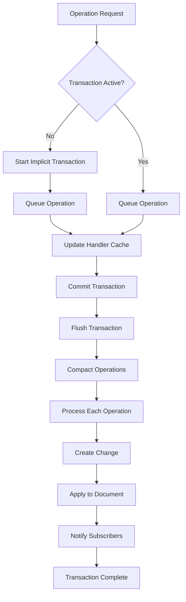

# CRDT LF

[![crdt_lf_badge][crdt_lf_badge]][pub_link]
[![pub points][pub_points]][pub_link]
[![pub likes][pub_likes]][pub_link]
[![codecov][codecov_badge]][codecov_link]
[![ci_badge][ci_badge]][ci_link]
[![License: MIT][license_badge]][license_link]
[![pub publisher][pub_publisher]][pub_publisher_link]

- [CRDT LF](#crdt-lf)
  - [Features](#features)
  - [Design](#design)
    - [Operation based](#operation-based)
    - [Transaction](#transaction)
  - [Getting Started](#getting-started)
  - [Usage](#usage)
    - [Basic Usage](#basic-usage)
    - [Dart Distributed Collaboration Example](#dart-distributed-collaboration-example)
    - [Flutter Distributed Collaboration Example](#flutter-distributed-collaboration-example)
  - [Sync](#sync)
  - [Persistence](#persistence)
  - [Benchmarks](#benchmarks)
  - [Architecture](#architecture)
    - [CRDTDocument](#crdtdocument)
      - [Identity](#identity)
    - [Handlers](#handlers)
      - [Caching](#caching)
      - [Working with Complex Types](#working-with-complex-types)
    - [Transaction](#transaction-1)
    - [DAG](#dag)
    - [Change](#change)
    - [Frontiers](#frontiers)
    - [Snapshot](#snapshot)
  - [Project Status](#project-status)
    - [Roadmap](#roadmap)
    - [Contributing](#contributing)
  - [Acknowledgments](#acknowledgments)
  - [Packages](#packages)


A Conflict-free Replicated Data Type (CRDT) implementation in Dart. 
This library provides solutions for:
- Text Editing.
- List Editing.
- Map Editing.
- Set Editing.
- Text Editing with Fugue Algorithm ([The Art of the Fugue: Minimizing Interleaving in Collaborative Text Editing" di Matthew Weidner e Martin Kleppmann](https://arxiv.org/abs/2305.00583)).

## Features

- ⏱️ **Hybrid Logical Clock**: Uses HLC for causal ordering of operations
- 🔄 **Automatic Conflict Resolution**: Automatically resolves conflicts in a CRDT
- 📦 **Local Availability**: Operations are available locally as soon as they are applied

## Design

### Operation based

The synchronization mechanism is operation-based (CmRDT). Each document manages synchronization by propagating **only the operations**. Locally, each handler (list, text, etc.) applies these operations to resolve its state. It's possible to create snapshots to establish an initial state on which operations are resolved. This is useful to prevent the memory requirements of the system from growing indefinitely. 
Operation resolution is handled by each individual handler. This design allows each handler to implement its own operation resolution logic according to its specific requirements. The library includes simple implementations like `CRDTList`, where interleaving is managed solely through HLC timestamps, as well as more sophisticated systems like `OR-Sets` and `Fugue Text`. Each handler provides documentation that describes its approach to operation resolution.

### Transaction

Each operation created by an handler is registered in the document. The document manages operations through a transaction system. A transaction is considered an atomic operation, and notifications to subscribers are sent only when the transaction is completed. If not explicitly declared, each operation is registered in an implicit transaction.

An explicit transaction creates an environment where operations are grouped together and applied atomically. At the end of the transaction, contiguous operations can be compacted into fewer operations through compound algorithms to reduce the number of changes created.




## Getting Started

Add this to your package's `pubspec.yaml` file:

```yaml
dependencies:
  crdt_lf: ^1.0.0
```

## Usage

### Basic Usage

```dart
import 'package:crdt_lf/crdt_lf.dart';

void main() {
  // Create a new document
  final doc = CRDTDocument(
    peerId: PeerId.parse('45ee6b65-b393-40b7-9755-8b66dc7d0518'),
  );

  // Create a text handler
  final text = CRDTFugueTextHandler(doc, 'text1');

  // Insert text
  text.insert(0, 'Hello');

  // Delete text
  text.delete(0, 2); // Deletes "He"

  // Get current value
  print(text.value); // Prints "llo"
}
```

### [Dart Distributed Collaboration Example](https://github.com/MattiaPispisa/crdt/tree/main/packages/crdt_lf/example/main.dart)
### [Flutter Distributed Collaboration Example](https://github.com/MattiaPispisa/crdt/tree/main/packages/crdt_lf/flutter_example)

## Sync 
A sync library is available in the [crdt_socket_sync](https://pub.dev/packages/crdt_socket_sync) package. And it's used to synchronize the CRDT state between peers. More info in the [README](https://github.com/MattiaPispisa/crdt/tree/main/packages/crdt_socket_sync/README.md) of the sync package.

A flutter example is available in the [flutter_example](https://github.com/MattiaPispisa/crdt/tree/main/packages/crdt_socket_sync/flutter_example) and provide a synced version of the  "Flutter Distributed Collaboration" Example. 


## Persistence
Persistence is not directly handled in this library but there are some out of the box solutions:
- [crdt_lf_hive](https://pub.dev/packages/crdt_lf_hive): adapters and utils for persist data using [Hive](https://pub.dev/packages/hive).

## Benchmarks

This package includes a suite of benchmarks to ensure performance and stability. You can find the latest results [here](https://github.com/MattiaPispisa/crdt/tree/main/packages/crdt_lf/benchmark/results.md).

To run the benchmarks yourself, execute the following script from the `packages/crdt_lf` directory:

```sh
./benchmark/run.sh
```
or run:

```sh
melos run benchmark
```

## Architecture

The library is built above the [hlc_dart](https://pub.dev/packages/hlc_dart) package and provide a solution to implement CRDT systems.

### CRDTDocument
The main document class that manages the CRDT state and handles synchronization between peers.

#### Identity
- `documentId`: identifies the document/resource (used for routing, persistence, and ACLs). It does not participate in operation identifiers.
- `peerId`: identifies the peer/author generating operations. It is embedded into `OperationId` together with the Hybrid Logical Clock.

If not provided, both are generated: `peerId` and `documentId`.

### Handlers
Handlers are the core components of the library. They manage the state of a specific type of data and provide operations to modify it.

- `CRDTFugueTextHandler`: Handles text editing with the Fugue algorithm.
- `CRDTListHandler`: Handles list editing.
- `CRDTTextHandler`: Handles text editing.
- `CRDTMapHandler`: Handles map editing.

```dart
final doc = CRDTDocument(
  documentId: 'todo-list-123',
  peerId: PeerId.parse('45ee6b65-b393-40b7-9755-8b66dc7d0518'),
);
final list = CRDTListHandler(doc, 'todo-list');
list.insert(0, 'Buy apples');
list.insert(1, 'Buy milk');
list.delete(0);
print(list.value); // Prints "[Buy milk]"
```

Every handler can be found in the [handlers](https://github.com/MattiaPispisa/crdt/tree/main/packages/crdt_lf/lib/src/handler) folder.

#### Caching
Parlare del fatto che ad ogni operazione viene chiesto all'handler di incrementare il proprio stato. La gestione della cache è gestita dal documento e ad ogni handler viene chiesto solo di incrementare o impostare il prorio stato. Questo sarà fornito dal documento all'handler sulla base dello stato corrente del documento.

#### Working with Complex Types

When using `CRDTListHandler<T>` or `CRDTMapHandler<T>` with complex object types (e.g., your own custom classes) for `T`, it's crucial to understand how data is managed.

The `value` of your complex object is directly embedded within the `Change`'s payload. This has two important implications:

1.  **Serialization**: If you plan to persist these `Change`s (e.g., using `crdt_lf_hive`) or send them over a network, you **must** have a strategy to serialize and deserialize your custom objects. The raw object cannot be stored or transmitted as-is. A common approach is to convert your object to a `Map<String, dynamic>` (e.g., by implementing `toJson()` and a `fromJson()` factory).

2.  **Immutability and Value Semantics**: When a `Change` is created, it captures the **state of the `value` at that specific moment**. If you later mutate the original object, the `Change` will still hold the old state. This can lead to unexpected behavior. It is highly recommended to treat your complex objects as **immutable**. When you need to modify an object, create a new instance with the updated values instead of mutating the existing one. This ensures that each `Change` is a predictable and self-contained snapshot of the operation.

**Example with a custom class:**

```dart
class MyData {
  final String name;
  final int count;

  MyData(this.name, this.count);

  // You need a way to serialize
  Map<String, dynamic> toJson() => {'name': name, 'count': count};

  // And a way to deserialize
  factory MyData.fromJson(Map<String, dynamic> json) {
    return MyData(json['name'], json['count']);
  }
}

// When using with a handler
final list = CRDTListHandler<MyData>(doc, 'my-data-list');

// GOOD: Create a new instance for the change
final data = MyData('item1', 1);
list.insert(0, data);

// BAD: Mutating the object after insertion
// This will NOT be reflected in the CRDT history
// data.count = 2; // Avoid this

// Instead, for updates, create a new instance
final updatedData = MyData('item1', 2);
list.update(0, updatedData);
```

**Alternative Approach: Store Raw Data**

A more robust pattern is to always store raw, serializable data (like `Map<String, dynamic>`) inside the handler. This forces serialization at the system's boundary and avoids accidental mutation issues.

```dart
// 1. Declare the handler with a raw type
final rawList = CRDTListHandler<Map<String, dynamic>>(doc, 'my-raw-list');

// 2. Serialize before inserting/updating
final data = MyData('item2', 1);
rawList.insert(0, data.toJson()); 

// 3. Deserialize when reading the value
final myDataList = rawList.value.map((map) => MyData.fromJson(map)).toList();
print(myDataList.first.name); // Prints "item2"
```

### Transaction

To manage operations in a transaction, use the `runInTransaction` method of the document.

```dart
doc.runInTransaction(() {
  listHandler.insert(0, 'item1');
  listHandler.insert(1, 'item2');
});
// only here doc notifies subscribers about the transaction completion
```

Within a transaction can also be executed changes and imports. Those actions are applied immediately but notified only at the end of the transaction.

```dart
doc.runInTransaction(() {
  listHandler.insert(0, 'item1');
  listHandler.insert(1, 'item2');

  // immediately applied
  doc.createChange(listHandler.insert(0, 'item1'));

  // immediately applied
  doc.importSnapshot(otherDocument.takeSnapshot());
});
// Insertions are compacted, processed and applied to the document.
// Doc notifies subscribers about the transaction completion
```


### DAG
A Directed Acyclic Graph that maintains the causal ordering of operations.

### Change
Represents a modification to the CRDT state, including operation ID, dependencies, and timestamp.

### Frontiers
A structure that manages the frontiers (latest operations) of the CRDT.

### Snapshot
A snapshot of the CRDT state, including the version vector and the data.

## Project Status

This library is currently **in progress** and under active development. While all existing functionality is thoroughly tested, we are continuously working on improvements and new features.

### Roadmap
A roadmap is available in the [project](https://github.com/users/MattiaPispisa/projects/1) page. The roadmap provides a high-level overview of the project's goals and the current status of the project.

### Contributing
We welcome contributions! Whether you want to:
- Fix bugs
- Add new features
- Improve documentation
- Optimize performance
- Or something else

Feel free to:
1. Check out our [GitHub repository](https://github.com/MattiaPispisa/crdt)
2. Look at the [open issues](https://github.com/MattiaPispisa/crdt/issues)
3. Submit a Pull Request

## Acknowledgments

- [Fugue Algorithm](https://arxiv.org/abs/2305.00583)
- [Hybrid Logical Clock](https://cse.buffalo.edu/tech-reports/2014-04.pdf)
- [A comprehensive study of Convergent and Commutative Replicated Data Types](https://inria.hal.science/inria-00555588/en/)

## Packages
Other bricks of the crdt "system" are:

- [hlc_dart](https://pub.dev/packages/hlc_dart)
- [crdt_socket_sync](https://pub.dev/packages/crdt_socket_sync)
- [crdt_lf_hive](https://pub.dev/packages/crdt_lf_hive)


[license_badge]: https://img.shields.io/badge/license-MIT-blue.svg
[license_link]: https://opensource.org/licenses/MIT
[crdt_lf_badge]: https://img.shields.io/pub/v/crdt_lf.svg
[codecov_badge]: https://img.shields.io/codecov/c/github/MattiaPispisa/crdt/main?flag=crdt_lf&logo=codecov
[codecov_link]: https://app.codecov.io/gh/MattiaPispisa/crdt/tree/main/packages/crdt_lf
[ci_badge]: https://img.shields.io/github/actions/workflow/status/MattiaPispisa/crdt/main.yaml
[ci_link]: https://github.com/MattiaPispisa/crdt/actions/workflows/main.yaml
[pub_points]: https://img.shields.io/pub/points/crdt_lf
[pub_link]: https://pub.dev/packages/crdt_lf
[pub_publisher]: https://img.shields.io/pub/publisher/crdt_lf
[pub_publisher_link]: https://pub.dev/packages?q=publisher%3Amattiapispisa.it
[pub_likes]: https://img.shields.io/pub/likes/crdt_lf