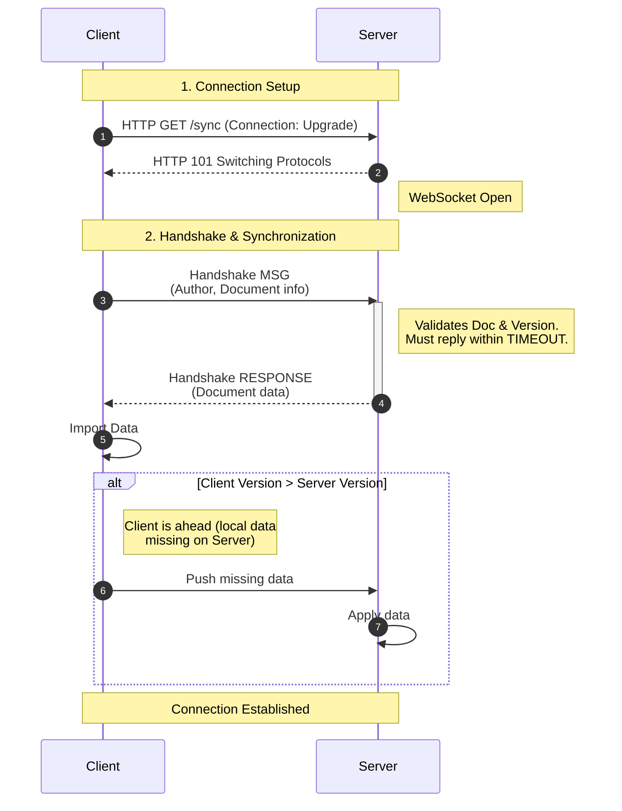
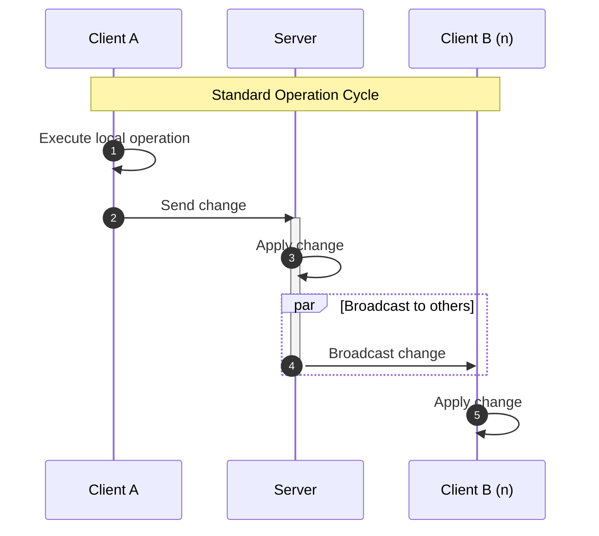
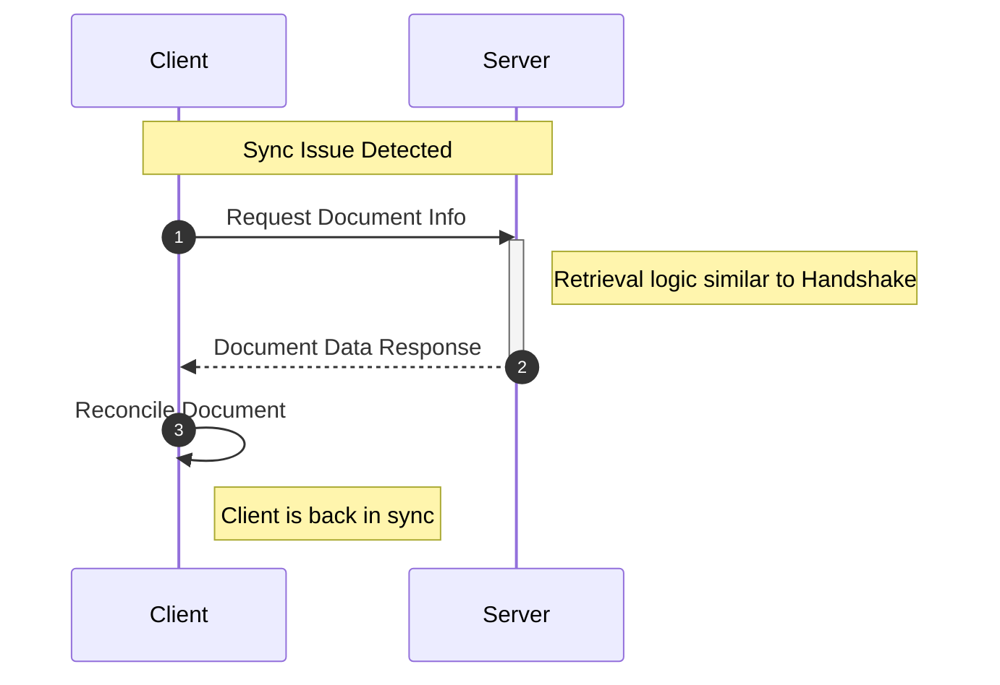

# CRDT Socket Sync

[![crdt_socket_sync_badge][crdt_socket_sync_badge]](https://pub.dev/packages/crdt_socket_sync) [![pub points][pub_points]][pub_link]
[![pub likes][pub_likes]][pub_link]
[![codecov][codecov_badge]][codecov_link]
[![ci_badge][ci_badge]][ci_link]
[![License: MIT][license_badge]][license_link]
[![pub publisher][pub_publisher]][pub_publisher_link]

- [CRDT Socket Sync](#crdt-socket-sync)
  - [Overview](#overview)
  - [Features](#features)
    - [Built-in Plugins](#built-in-plugins)
  - [Installation](#installation)
  - [Quick Start](#quick-start)
    - [Server Setup](#server-setup)
    - [Client Setup](#client-setup)
    - [Plugins](#plugins)
      - [Awareness Plugin](#awareness-plugin)
  - [Design](#design)
    - [Connection \& Handshake Phase](#connection--handshake-phase)
    - [Real-time Updates](#real-time-updates)
    - [Herror handling](#herror-handling)
  - [Examples](#examples)
  - [Library Structure](#library-structure)
    - [Import Options](#import-options)
      - [For Client Applications](#for-client-applications)
      - [For Server Applications](#for-server-applications)
  - [Advanced Usage](#advanced-usage)
    - [Custom Document Registry](#custom-document-registry)
    - [Compression](#compression)
    - [Event Monitoring](#event-monitoring)
  - [Protocol Details](#protocol-details)
  - [Error Handling](#error-handling)
  - [Packages](#packages)
  - [Roadmap](#roadmap)
  - [Contributing](#contributing)
  - [Packages](#packages-1)

A comprehensive Dart package for synchronizing Conflict-free Replicated Data Types (CRDTs) between multiple clients and a server.

## Overview

CRDT Socket Sync provides a robust, real-time synchronization system that allows multiple clients to collaborate on shared documents without conflicts. Built on top of [crdt_lf](https://pub.dev/packages/crdt_lf), this package enables seamless data synchronization with automatic conflict resolution.

## Features

- 🔄 **Real-time Synchronization**: Instant propagation of changes across all connected clients
- 🌐 **WebSocket Support**: Built-in WebSocket client and server implementations
- 🔧 **Conflict Resolution**: Automatic conflict-free merge of concurrent operations
- 📦 **Compression**: Optional data compression for efficient network usage
- 🔌 **Modular Architecture**: Separate client and server components with clean abstractions
- 📡 **Automatic Reconnection**: Robust connection handling with automatic retry logic
- 🎯 **Type Safety**: Full Dart type safety with generic document handlers
- 📊 **Event Monitoring**: Comprehensive event streams for connection and synchronization monitoring
- 🔌 **Plugins**: Extendable plugin system for custom functionality

### Built-in Plugins

- 📡 **Awareness Plugin**: Track the awareness of the clients.

## Installation

Add this package to your `pubspec.yaml`:

```yaml
dependencies:
  crdt_socket_sync: 
  crdt_lf:
```

Then run:

```bash
dart pub get
```

## Quick Start

### Server Setup

```dart
import 'package:crdt_socket_sync/src/web_socket_server.dart';

void main() async {
  // Create a server registry to manage documents
  final registry = InMemoryServerRegistry();
  
  // Create and start the WebSocket server
  final server = WebSocketServer(
    host: 'localhost',
    port: 8080,
    serverRegistry: registry,
  );
  
  await server.start();
  print('Server started on localhost:8080');
  
  // Listen to server events
  server.serverEvents.listen((event) {
    print('Server event: ${event.type} - ${event.message}');
  });
}
```

### Client Setup

```dart
import 'package:crdt_socket_sync/src/web_socket_client.dart';
import 'package:crdt_lf/crdt_lf.dart';

void main() async {
  // Create a CRDT document
  final document = CRDTDocument.create(peerId: PeerId.generate());
  
  // Register handlers for different data types
  final listHandler = CRDTListHandler<String>(document, 'shared_list');
  document.registerHandler(listHandler);
  
  // Create the client
  final client = WebSocketClient(
    url: 'ws://localhost:8080',
    document: document,
    author: document.peerId,
  );
  
  // Monitor connection status
  client.connectionStatus.listen((status) {
    print('Connection status: $status');
  });
  
  // Connect to server
  final connected = await client.connect();
  if (connected) {
    print('Connected successfully!');
    
    // Make changes to the document
    listHandler.insert(0, 'Hello, World!');
  }
}
```

### Plugins

The package provides a plugin system that allows you to extend the functionality of the client and the server.
A plugin can be only on the client or only on the server or both.

```dart
// it's important that `MyClientPlugin` extends `ClientSyncPlugin` (not implements).
// `ClientSyncPlugin` makes some "magic" to make the plugin work.
class MyClientPlugin extends ClientSyncPlugin {
  @override
  void onMessage(Message message) {
    print('message: $message');
  }
}

// it's important that `MyServerPlugin` extends `ServerSyncPlugin` (not implements).
// `ServerSyncPlugin` makes some "magic" to make the plugin work.
class MyServerPlugin extends ServerSyncPlugin {
  @override
  void onMessage(Message message) {
    print('message: $message');
  }
}

final client = WebSocketClient(
  url: 'ws://localhost:8080',
  document: document,
  author: document.peerId,
  plugins: [MyClientPlugin()],
);

final server = WebSocketServer(
  host: 'localhost',
  port: 8080,
  serverRegistry: registry,
  plugins: [MyServerPlugin()],
);
```

A plugin can send new message types to clients and the server. To do so, it must extend the `Message` class and implement the `fromJson` method to decode the messages.

#### Awareness Plugin

The awareness plugin is a plugin that allows you to track the awareness of the clients.
It is a plugin that is both on the client and the server.
It is used to track the awareness of the clients and to send the awareness to the server and to the clients.

The example provided uses the awareness plugin to track the active users (name, surname, random color) and their relative position in the document.


## Design

### Connection & Handshake Phase


The diagram was created using [Mermaid](https://mermaid.js.org/). 
GitHub natively supports this tool, but if you are unable to view them, 
you can use the [official vscode extension](https://open-vsx.org/extension/MermaidChart/vscode-mermaid-chart) or the, [Mermaid Live Editor](https://mermaid.live/).

### Real-time Updates



The diagram was created using [Mermaid](https://mermaid.js.org/). 
GitHub natively supports this tool, but if you are unable to view them, 
you can use the [official vscode extension](https://open-vsx.org/extension/MermaidChart/vscode-mermaid-chart) or the, [Mermaid Live Editor](https://mermaid.live/).

### Herror handling



The diagram was created using [Mermaid](https://mermaid.js.org/). 
GitHub natively supports this tool, but if you are unable to view them, 
you can use the [official vscode extension](https://open-vsx.org/extension/MermaidChart/vscode-mermaid-chart) or the, [Mermaid Live Editor](https://mermaid.live/).

## Examples

This package provided some examples:

In the [example/](https://github.com/MattiaPispisa/crdt/tree/main/packages/crdt_socket_sync/example) directory you can find a complete working example of the server and the client (dart).

In the [flutter_example/](https://github.com/MattiaPispisa/crdt/tree/main/packages/crdt_socket_sync/flutter_example) directory you can find a complete working example of a flutter app that uses the server and the client.

Try to run the [server example](https://github.com/MattiaPispisa/crdt/tree/main/packages/crdt_socket_sync/example/main.dart) and some [client applications](https://github.com/MattiaPispisa/crdt/tree/main/packages/crdt_socket_sync/flutter_example) (or the [dart client](https://github.com/MattiaPispisa/crdt/tree/main/packages/crdt_socket_sync/example/main_client.dart)).
The workspace contains a .vscode folder with the launch settings for the examples.


The server example and the flutter example already use the awareness plugin.


## Library Structure

The package is organized into several modules for different use cases:

### Import Options

#### For Client Applications
```dart
// Basic client interfaces
import 'package:crdt_socket_sync/client.dart';

// WebSocket client implementation
import 'package:crdt_socket_sync/web_socket_client.dart';
```

#### For Server Applications
```dart
// Basic server interfaces
import 'package:crdt_socket_sync/server.dart';

// WebSocket server implementation
import 'package:crdt_socket_sync/web_socket_server.dart';
```
## Advanced Usage

### Custom Document Registry

Implement your own document storage backend:

```dart
class CustomServerRegistry implements CRDTServerRegistry {
  final Map<String, CRDTDocument> _documents = {};
  
  @override
  CRDTDocument? getDocument(String documentId) {
    return _documents[documentId];
  }
  
  @override
  void setDocument(String documentId, CRDTDocument document) {
    _documents[documentId] = document;
  }
  
  @override
  List<String> get documentIds => _documents.keys.toList();
}
```

### Compression

Enable data compression for reduced bandwidth usage:

```dart
// Server with compression
final server = WebSocketServer(
  host: 'localhost',
  port: 8080,
  serverRegistry: registry,
  compressor: GzipCompressor(), // or your custom compressor
);

// Client with compression
final client = WebSocketClient(
  url: 'ws://localhost:8080',
  document: document,
  author: author,
  compressor: GzipCompressor(),
);
```

### Event Monitoring

Monitor detailed synchronization events:

```dart
// Server events
server.serverEvents.listen((event) {
  switch (event.type) {
    case ServerEventType.clientConnected:
      print('Client ${event.data?['clientId']} connected');
      break;
    case ServerEventType.clientDisconnected:
      print('Client ${event.data?['clientId']} disconnected');
      break;
    case ServerEventType.clientChangeApplied:
      print('Change applied from client');
      break;
  }
});

// Client messages
client.messages.listen((message) {
  switch (message.type) {
    case MessageType.change:
      print('Received change from server');
      break;
    case MessageType.snapshot:
      print('Received snapshot from server');
      break;
  }
});
```

## Protocol Details

The synchronization protocol includes:

- **Handshake**: Initial client-server negotiation with version exchange
- **Changes**: Real-time propagation of CRDT operations
- **Snapshots**: Full document state synchronization
- **Ping/Pong**: Connection health monitoring
- **Error Handling**: Graceful error recovery and reporting

## Error Handling

The library provides robust error handling with automatic recovery:

```dart
client.connectionStatus.listen((status) {
  switch (status) {
    case ConnectionStatus.connected:
      // Normal operation
      break;
    case ConnectionStatus.reconnecting:
      // Automatic reconnection in progress
      break;
    case ConnectionStatus.error:
      // Handle connection errors
      break;
    case ConnectionStatus.disconnected:
      // Clean disconnection
      break;
  }
});
```


## Packages
Other bricks of the crdt "system" are:

- [crdt_lf](https://pub.dev/packages/crdt_lf)
- [hlc_dart](https://pub.dev/packages/hlc_dart)

## [Roadmap](https://github.com/users/MattiaPispisa/projects/1)
A roadmap is available in the [project](https://github.com/users/MattiaPispisa/projects/1) page. The roadmap provides a high-level overview of the project's goals and the current status of the project.


## Contributing

Contributions are welcome! Please read the contributing guidelines and submit pull requests to the main repository.

## Packages

Other bricks of the crdt "system" are:

- [crdt_lf](https://pub.dev/packages/crdt_lf)
- [hlc_dart](https://pub.dev/packages/hlc_dart)
- [crdt_lf_hive](https://pub.dev/packages/crdt_lf_hive)


[crdt_socket_sync_badge]: https://img.shields.io/pub/v/crdt_socket_sync.svg
[license_badge]: https://img.shields.io/badge/license-MIT-blue.svg
[codecov_badge]: https://img.shields.io/codecov/c/github/MattiaPispisa/crdt/main?flag=crdt_socket_sync&logo=codecov
[codecov_link]: https://app.codecov.io/gh/MattiaPispisa/crdt/tree/main/packages/crdt_socket_sync
[license_link]: https://opensource.org/licenses/MIT
[pub_link]: https://pub.dev/packages/crdt_socket_sync
[pub_points]: https://img.shields.io/pub/points/crdt_socket_sync
[pub_likes]: https://img.shields.io/pub/likes/crdt_socket_sync
[codecov_badge]: https://codecov.io/gh/MattiaPispisa/crdt/branch/main/graph/badge.svg?token=00000000-0000-0000-0000-000000000000
[codecov_link]: https://codecov.io/gh/MattiaPispisa/crdt
[ci_badge]: https://img.shields.io/github/actions/workflow/status/MattiaPispisa/crdt/main.yaml
[ci_link]: https://github.com/MattiaPispisa/crdt/actions/workflows/main.yaml
[pub_publisher]: https://img.shields.io/pub/publisher/crdt_socket_sync
[pub_publisher_link]: https://pub.dev/packages?q=publisher%3Amattiapispisa.it