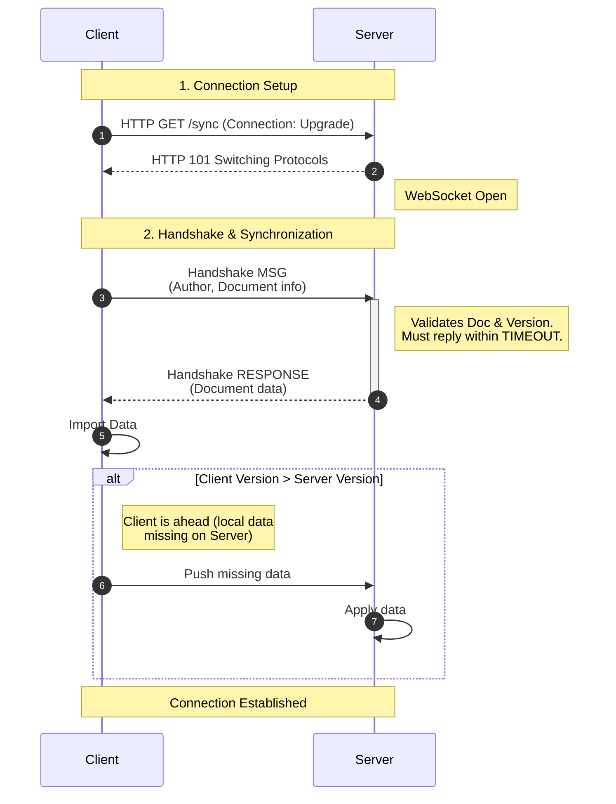
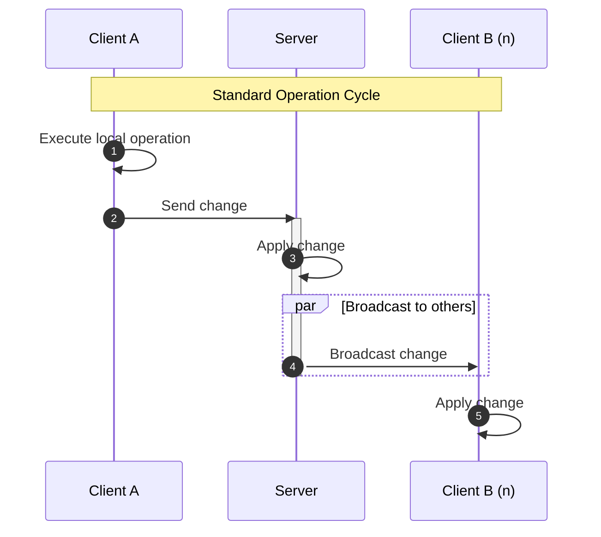
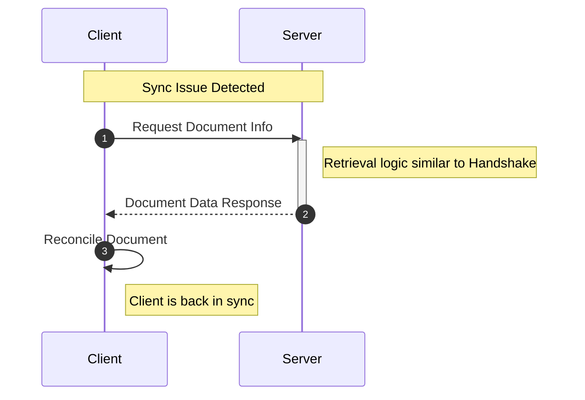
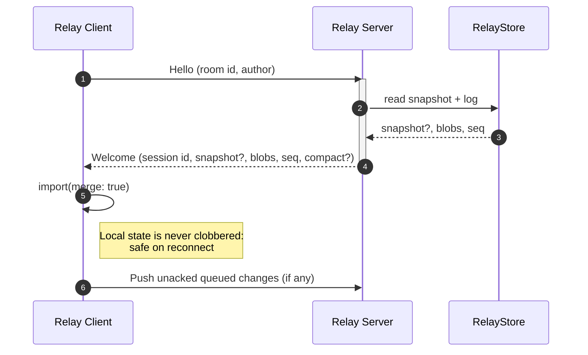
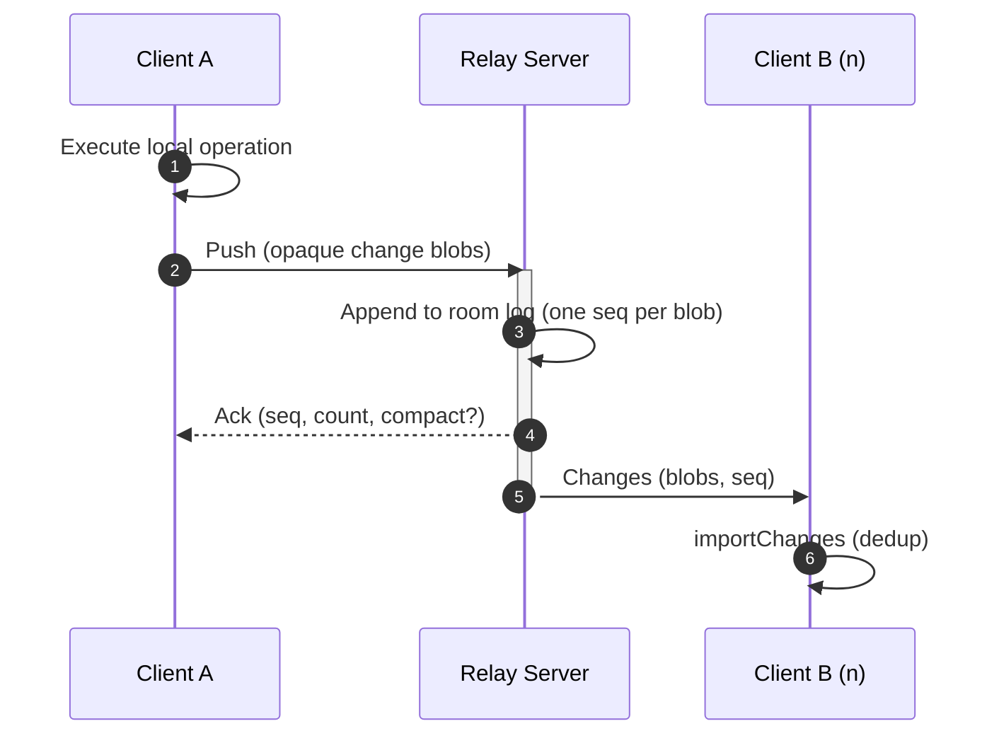
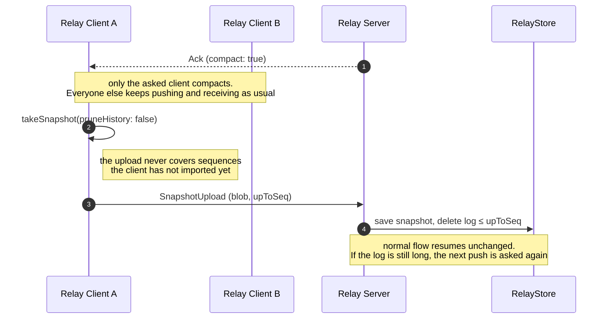
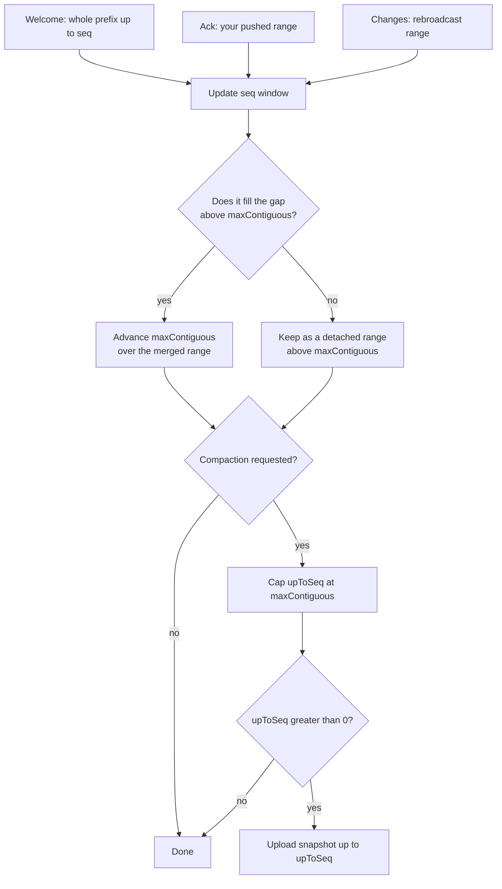

# CRDT Socket Sync

[![crdt_socket_sync_badge][crdt_socket_sync_badge]](https://pub.dev/packages/crdt_socket_sync) [![pub points][pub_points]][pub_link]
[![pub likes][pub_likes]][pub_link]
[![codecov][codecov_badge]][codecov_link]
[![ci_badge][ci_badge]][ci_link]
[![License: MIT][license_badge]][license_link]
[![pub publisher][pub_publisher]][pub_publisher_link]

[![docs_badge]][docs_link]

- [CRDT Socket Sync](#crdt-socket-sync)
  - [Overview](#overview)
  - [Features](#features)
    - [Built-in Plugins](#built-in-plugins)
  - [Installation](#installation)
  - [Communication modes](#communication-modes)
  - [Server–Client mode (CRDT-aware)](#serverclient-mode-crdt-aware)
    - [Quick Start](#quick-start)
      - [Server Setup](#server-setup)
      - [Client Setup](#client-setup)
    - [How it works](#how-it-works)
      - [Connection \& Handshake Phase](#connection--handshake-phase)
      - [Real-time Updates](#real-time-updates)
      - [Out-of-sync Recovery](#out-of-sync-recovery)
    - [Server Registry](#server-registry)
      - [Persisting changes \& snapshots](#persisting-changes--snapshots)
    - [Server Events](#server-events)
    - [Imports](#imports)
  - [Relay Mode](#relay-mode)
    - [When to use it](#when-to-use-it)
    - [Relay Quick Start](#relay-quick-start)
    - [Join \& Welcome](#join--welcome)
    - [Push, Ack \& Rebroadcast](#push-ack--rebroadcast)
    - [Log Compaction](#log-compaction)
    - [Client seq window](#client-seq-window)
    - [Relay Plugins \& Awareness](#relay-plugins--awareness)
    - [Implementing a relay server](#implementing-a-relay-server)
    - [Relay Imports](#relay-imports)
  - [Shared topics](#shared-topics)
    - [Plugins](#plugins)
      - [Awareness Plugin](#awareness-plugin)
    - [Compression](#compression)
    - [Connection status \& error handling](#connection-status--error-handling)
    - [Wire format \& type codes](#wire-format--type-codes)
  - [Examples](#examples)
  - [Apps](#apps)
  - [Roadmap](#roadmap)
  - [Contributing](#contributing)
  - [Packages](#packages)

A comprehensive Dart package for synchronizing Conflict-free Replicated Data Types (CRDTs) between multiple clients and a server.

## Overview

CRDT Socket Sync provides a robust, real-time synchronization system that allows multiple clients to collaborate on shared documents without conflicts. Built on top of [crdt_lf](https://pub.dev/packages/crdt_lf), this package enables seamless data synchronization with automatic conflict resolution.

## Features

- 🔄 **Real-time Synchronization**: Instant propagation of changes across all connected clients
- 🌐 **WebSocket Support**: Built-in WebSocket client and server implementations
- 🔧 **Conflict Resolution**: Automatic conflict-free merge of concurrent operations
- 📦 **Compression**: Optional data compression for efficient network usage
- 🔌 **Modular Architecture**: Separate client and server components with clean abstractions
- 📡 **Automatic Reconnection**: Robust connection handling with automatic retry logic
- 💓 **Liveness Detection**: Ping/pong tracking detects half-open connections and reconnects
- 🚰 **Backpressure**: Bounded per-connection send queue drops peers that cannot keep up (they re-sync on reconnect)
- 🗜️ **History Pruning**: Server takes a snapshot and prunes confirmed history once every client aligns on a common frontier
- 🎯 **Type Safety**: Full Dart type safety with generic document handlers
- 📊 **Event Monitoring**: Comprehensive event streams for connection and synchronization monitoring
- 🔌 **Plugins**: Extendable plugin system for custom functionality
- 📮 **Relay Mode**: An alternative sync model where the server is a CRDT-agnostic relay — it persists and rebroadcasts opaque change blobs while merging happens entirely on the clients ([details](#relay-mode))

### Built-in Plugins

- 📡 **Awareness Plugin**: Track the awareness of the clients.

## Installation

Add this package to your `pubspec.yaml`:

```yaml
dependencies:
  crdt_socket_sync: 
  crdt_lf:
```

Then run:

```bash
dart pub get
```

## Communication modes

The package ships **two independent synchronization models**. Pick one per
deployment — the wire format, type-code convention and the plugin system are
shared, but the server responsibilities are very different:

- **[Server–Client mode (CRDT-aware)](#serverclient-mode-crdt-aware)** — the
  server holds the documents, applies incoming changes, computes deltas and
  prunes confirmed history. Use it when you want a single authoritative backend
  that understands `crdt_lf`.
- **[Relay mode](#relay-mode)** — the server is *dumb*: it persists and
  rebroadcasts opaque change blobs per room and never parses CRDT data; merging
  happens entirely on the clients. Use it for cheap horizontal rooms, easy
  porting to other runtimes (including serverless), and to keep the backend free
  of `crdt_lf`.

Cross-cutting concerns (plugins, compression, wire format, connection status)
are documented once under [Shared topics](#shared-topics).

## Server–Client mode (CRDT-aware)

In this mode the server owns the documents through a
[`CRDTServerRegistry`](#server-registry): it validates handshakes with version
vectors, applies incoming changes, broadcasts them to the other clients, and
takes snapshots to prune confirmed history.

### Quick Start

#### Server Setup

```dart
import 'dart:io';
import 'package:crdt_socket_sync/web_socket_server.dart';

void main() async {
  // Create a server registry to manage documents
  final registry = InMemoryCRDTServerRegistry();

  // Create and start the WebSocket server
  final server = WebSocketServer(
    serverFactory: () => HttpServer.bind('localhost', 8080),
    serverRegistry: registry,
  );

  await server.start();
  print('Server started on localhost:8080');

  // Listen to server events
  server.serverEvents.listen((event) {
    print('Server event: ${event.type} - ${event.message}');
  });
}
```

#### Client Setup

```dart
import 'package:crdt_socket_sync/web_socket_client.dart';
import 'package:crdt_lf/crdt_lf.dart';

void main() async {
  // Create a CRDT document
  final document = CRDTDocument(peerId: PeerId.generate());

  // Register handlers for different data types
  final listHandler = CRDTListHandler<String>(document, 'shared_list');

  // Create the client
  final client = WebSocketClient(
    url: 'ws://localhost:8080',
    document: document,
    author: document.peerId,
  );

  // Monitor connection status
  client.connectionStatus.listen((status) {
    print('Connection status: $status');
  });

  // Connect to server
  final connected = await client.connect();
  if (connected) {
    print('Connected successfully!');

    // Make changes to the document
    listHandler.insert(0, 'Hello, World!');
  }
}
```

### How it works

#### Connection & Handshake Phase

```mermaid
sequenceDiagram
    autonumber
    participant C as Client
    participant S as Server

    %% Socket Upgrade
    Note over C,S: 1. Connection Setup
    C->>S: HTTP GET /sync (Connection: Upgrade)
    S-->>C: HTTP 101 Switching Protocols
    Note right of S: WebSocket Open

    %% Handshake
    Note over C,S: 2. Handshake & Synchronization
    C->>S: Handshake MSG<br/>(Author, Document info)
    
    activate S
    Note right of S: Validates Doc & Version.<br/>Must reply within TIMEOUT.
    S-->>C: Handshake RESPONSE<br/>(Document data)
    deactivate S

    %% Import & Push back
    C->>C: Import Data
    
    alt Client Version > Server Version
        Note right of C: Client is ahead (local data<br/>missing on Server)
        C->>S: Push missing data
        S->>S: Apply data
    end

    Note over C,S: Connection Established
```

> 📖 Diagrams render best in the [live documentation](https://mattiapispisa.it/crdt/docs/documentation/packages/crdt_socket_sync).

#### Real-time Updates


```mermaid
sequenceDiagram
    autonumber
    participant CA as Client A
    participant S as Server
    participant CB as Client B (n)

    Note over CA, CB: Standard Operation Cycle
    
    CA->>CA: Execute local operation
    CA->>S: Send change
    
    activate S
    S->>S: Apply change
    
    par Broadcast to others
        S->>CB: Broadcast change
        %% You can add more clients here conceptually
    end
    deactivate S
    
    CB->>CB: Apply change
```

> 📖 Diagrams render best in the [live documentation](https://mattiapispisa.it/crdt/docs/documentation/packages/crdt_socket_sync).

#### Out-of-sync Recovery


```mermaid
sequenceDiagram
    autonumber
    participant C as Client
    participant S as Server

    Note over C, S: Sync Issue Detected
    
    C->>S: Request Document Info 
    
    activate S
    Note right of S: Retrieval logic similar to Handshake
    S-->>C: Document Data Response
    deactivate S
    
    C->>C: Reconcile Document
    Note right of C: Client is back in sync
```

> 📖 Diagrams render best in the [live documentation](https://mattiapispisa.it/crdt/docs/documentation/packages/crdt_socket_sync).

### Server Registry

The server stores documents through a `CRDTServerRegistry`. The bundled
`InMemoryCRDTServerRegistry` keeps everything in memory (documents are lost on
restart); implement the interface to plug in your own persistence backend.

The interface is fully asynchronous:

```dart
class CustomServerRegistry implements CRDTServerRegistry {
  final Map<String, CRDTDocument> _documents = {};

  @override
  Future<void> addDocument(String documentId, {PeerId? author}) async {
    _documents[documentId] = CRDTDocument(
      peerId: author ?? PeerId.generate(),
      documentId: documentId,
    );
  }

  @override
  Future<CRDTDocument?> getDocument(String documentId) async =>
      _documents[documentId];

  @override
  Future<bool> hasDocument(String documentId) async =>
      _documents.containsKey(documentId);

  @override
  Future<Set<String>> get documentIds async => _documents.keys.toSet();

  // ... removeDocument, documentCount, createSnapshot, getLatestSnapshot,
  //     applyChange (see the CRDTServerRegistry interface for the full list).
}
```

> `applyChange` MUST let `CausallyNotReadyException` propagate: the server relies
> on it to detect an out-of-sync client and trigger a re-sync. Swallowing it
> would silently drop the change.

#### Persisting changes & snapshots

`InMemoryCRDTServerRegistry` is not durable — documents are lost on restart. To
persist a registry, back it with one of the `crdt_lf` storage adapters. Each
exposes a `CRDTDocumentStorage` with `changes` and `snapshots` stores you
read/write from inside your `CRDTServerRegistry` (`saveChanges`, `getChanges`,
`saveSnapshot`, `getSnapshots`, …):

- [crdt_lf_hive](https://pub.dev/packages/crdt_lf_hive) — Hive-backed storage
- [crdt_lf_drift](https://pub.dev/packages/crdt_lf_drift) — Drift (SQL) storage
- [crdt_lf_sqlite](https://pub.dev/packages/crdt_lf_sqlite) — `sqlite3` storage

For a complete server-side implementation, see the example
[`HiveServerRegistry`](https://github.com/MattiaPispisa/crdt/blob/main/packages/crdt_socket_sync/example/lib/src/registry.dart):
it lazy-loads documents from Hive on first access, appends each change to
storage, and periodically snapshots to compact the change history.

### Server Events

Monitor detailed synchronization events on the server:

```dart
server.serverEvents.listen((event) {
  switch (event.type) {
    case ServerEventType.clientConnected:
      print('Client ${event.data?['clientId']} connected');
      break;
    case ServerEventType.clientDisconnected:
      print('Client ${event.data?['clientId']} disconnected');
      break;
    case ServerEventType.clientChangeApplied:
      print('Change applied from client');
      break;
    // clientHandshake, clientDocumentStatusCreated, clientOutOfSync,
    // messageBroadcasted, messageSent, snapshotCreated, error, ...
  }
});
```

### Imports

```dart
// Basic client interfaces
import 'package:crdt_socket_sync/client.dart';

// WebSocket client implementation
import 'package:crdt_socket_sync/web_socket_client.dart';

// Basic server interfaces
import 'package:crdt_socket_sync/server.dart';

// WebSocket server implementation
import 'package:crdt_socket_sync/web_socket_server.dart';
```

## Relay Mode

The package ships a second, independent sync model next to the CRDT-aware
server described above: **relay mode**. Here the server is a *dumb* relay — it
persists and rebroadcasts opaque change blobs per room and never interprets
CRDT data; merging happens entirely on the clients. The room is identified by
the document id: one relay server hosts many rooms.

### When to use it

The only fundamental difference between the two modes is **where the CRDT logic
lives**:

- **Server–Client (CRDT-aware)** — the server understands `crdt_lf`: it applies
  and merges changes and computes the deltas each client needs.
- **Relay** — all the CRDT logic runs on the clients; the server only stores the
  changes opaquely and rebroadcasts them, never parsing CRDT data.

Everything else (delivery guarantees, reconnect policy, initial sync) follows
from that choice. Pick **relay** when you want a CRDT-agnostic backend (no
`crdt_lf` on the server, easy to port to other runtimes); pick **server–client**
when a single authoritative backend should understand and merge the documents.

### Relay Quick Start

```dart
// Server
import 'dart:io';
import 'package:crdt_socket_sync/web_socket_relay_server.dart';

void main() async {
  final server = WebSocketRelayServer(
    serverFactory: () => HttpServer.bind('localhost', 8080),
    // store: defaults to InMemoryRelayStore()
  );
  await server.start();
}
```

```dart
// Client
import 'package:crdt_lf/crdt_lf.dart';
import 'package:crdt_socket_sync/web_socket_relay_client.dart';

void main() async {
  final document = CRDTDocument(
    peerId: PeerId.generate(),
    documentId: 'my-room',
  );
  final text = CRDTFugueTextHandler(document, 'content');

  final client = WebSocketRelayClient(
    url: 'ws://localhost:8080',
    document: document,
    author: document.peerId,
  );

  await client.connect();
  text.insert(0, 'Hello, relay!'); // queued, pushed, acked, rebroadcast
}
```

Local edits are delivered **at-least-once**: a change leaves the client
queue only when the relay acknowledges it, and unacked changes survive
reconnects (re-delivery is harmless because peers de-duplicate imported
changes). Persistence is pluggable through the `RelayStore` interface
(`InMemoryRelayStore` by default).

### Join & Welcome


```mermaid
sequenceDiagram
    autonumber
    participant C as Relay Client
    participant R as Relay Server
    participant S as RelayStore

    C->>R: Hello (room id, author)
    activate R
    R->>S: read snapshot + log
    S-->>R: snapshot?, blobs, seq
    R-->>C: Welcome (session id, snapshot?, blobs, seq, compact?)
    deactivate R

    C->>C: import(merge: true)
    Note right of C: Local state is never clobbered:<br/>safe on reconnect
    C->>R: Push unacked queued changes (if any)
```

> 📖 Diagrams render best in the [live documentation](https://mattiapispisa.it/crdt/docs/documentation/packages/crdt_socket_sync).

### Push, Ack & Rebroadcast


```mermaid
sequenceDiagram
    autonumber
    participant CA as Client A
    participant R as Relay Server
    participant CB as Client B (n)

    CA->>CA: Execute local operation
    CA->>R: Push (opaque change blobs)

    activate R
    R->>R: Append to room log (one seq per blob)
    R-->>CA: Ack (seq, count, compact?)
    R->>CB: Changes (blobs, seq)
    deactivate R

    CB->>CB: importChanges (dedup)
```

> 📖 Diagrams render best in the [live documentation](https://mattiapispisa.it/crdt/docs/documentation/packages/crdt_socket_sync).

### Log Compaction

The room log grows with every push. Past a threshold
(`RelayProtocol.logCompactThreshold`), the relay sets `compact: true` on an
ack or welcome, asking **that one client** (rate-limited per room) to upload
a snapshot. The relay stores the snapshot and deletes the covered log
entries; late joiners then bootstrap from snapshot plus residual log.


```mermaid
sequenceDiagram
    autonumber
    participant CA as Relay Client A
    participant CB as Relay Client B
    participant R as Relay Server
    participant S as RelayStore

    R-->>CA: Ack (compact: true)
    Note over CA,CB: only the asked client compacts.<br/>Everyone else keeps pushing and receiving as usual
    CA->>CA: takeSnapshot(pruneHistory: false)
    Note right of CA: the upload never covers sequences<br/>the client has not imported yet
    CA->>R: SnapshotUpload (blob, upToSeq)
    R->>S: save snapshot, delete log ≤ upToSeq
    Note over R,S: normal flow resumes unchanged.<br/>If the log is still long, the next push is asked again
```

> 📖 Diagrams render best in the [live documentation](https://mattiapispisa.it/crdt/docs/documentation/packages/crdt_socket_sync).

The client caps `upToSeq` at the highest **contiguous** sequence it has
imported, so a snapshot can never silently drop a concurrent change that the
relay logged but this client has not received yet.

### Client seq window

The relay stamps every change blob with a monotonic **seq**. Each client keeps a
window over the room log: `maxContiguous` — the highest seq `S` such that it has
imported *every* entry in `[1, S]` — plus any **detached ranges** above it, the
holes left when concurrent clients' rebroadcasts arrive out of order. Three
inbound frames feed the window — a **welcome** (the whole prefix), an **ack** of
your own push, and rebroadcast **changes** — and whenever a hole fills, the
contiguous frontier advances.

`maxContiguous` is the only thing that bounds a snapshot upload: a compaction
request is capped at it, so the client can never claim to cover a seq it has not
imported (which would let the relay delete a change no snapshot holds). The seq
window is pure relay bookkeeping — it does **not** decide what the document
shows; that is the CRDT's own causal job (`importChanges` applies the
causally-ready subset and skips the rest).


```mermaid
graph TD
    W[Welcome: whole prefix up to seq] --> UP1[Update seq window]
    A[Ack: your pushed range] --> UP1
    CH[Changes: rebroadcast range] --> UP1

    UP1 --> M{Does it fill the gap<br/>above maxContiguous?}
    M -->|yes| ADV[Advance maxContiguous<br/>over the merged range]
    M -->|no| HOLD[Keep as a detached range<br/>above maxContiguous]

    ADV --> C{Compaction requested?}
    HOLD --> C
    C -->|no| DONE[Done]
    C -->|yes| CAP[Cap upToSeq at maxContiguous]
    CAP --> G{upToSeq greater than 0?}
    G -->|no| DONE
    G -->|yes| UPL[Upload snapshot up to upToSeq]
```

> 📖 Diagrams render best in the [live documentation](https://mattiapispisa.it/crdt/docs/documentation/packages/crdt_socket_sync).

### Relay Plugins & Awareness

The relay client and server are regular `CRDTSocketClient` /
`CRDTSocketServer` implementations, so the [plugin system](#plugins) works
unchanged — including the [awareness plugin](#awareness-plugin), since presence
only needs sessions and broadcasting, never CRDT parsing:

```dart
final server = WebSocketRelayServer(
  serverFactory: () => HttpServer.bind('localhost', 8080),
  plugins: [ServerAwarenessPlugin()],
);

final client = WebSocketRelayClient(
  url: 'ws://localhost:8080',
  document: document,
  author: document.peerId,
  plugins: [ClientAwarenessPlugin()],
);
```

Awareness state is ephemeral: it is rebroadcast to the room but never
persisted in the `RelayStore`.

### Implementing a relay server

`WebSocketRelayServer` is only *one* implementation of the relay contract.
Because the server never parses CRDT data, the relay side is just a JSON
message contract over a WebSocket and can be implemented on any runtime —
including serverless hosts such as Cloudflare Workers + Durable Objects.

The [greyhound_markdown](https://github.com/MattiaPispisa/crdt/tree/main/apps/greyhound_markdown)
app is a concrete example: its client uses `WebSocketRelayClient` from **this
library**, while its server is currently a **Cloudflare Worker in TypeScript**
([`server/`](https://github.com/MattiaPispisa/crdt/tree/main/apps/greyhound_markdown/server),
run with `wrangler`) rather than the Dart `WebSocketRelayServer` — a TypeScript
reference implementation of the relay contract below.

Frames are JSON envelopes typed by an integer `type` code, with `documentId`
identifying the room. CRDT change/snapshot payloads travel as **opaque
base64 strings**. Your server must handle:

| Code | Name | Dir | Fields (beyond `type`, `documentId`) |
|---|---|---|---|
| 20 | hello | C→S | `author` |
| 21 | welcome | S→C | `sessionId`, `snapshot: string\|null`, `changes: string[]`, `seq`, `logLength`, `compact` |
| 22 | push | C→S | `changes: string[]` |
| 23 | ack | S→C | `seq`, `count`, `logLength`, `compact` |
| 24 | changes | S→others | `changes: string[]`, `seq`, `from: string\|null` |
| 25 | snapshotUpload | C→S | `snapshot`, `upToSeq` |
| 26 | stateRequest | C→S | — (reply with a welcome, same `sessionId`) |
| 5 | ping | C→S | `timestamp` → reply pong (6) `{originalTimestamp, responseTimestamp}` |
| 7 | error | S→C | `code`, `message` |
| 100–102 | awareness | C↔S | presence passthrough (store + rebroadcast) |

Server responsibilities: assign a `sessionId` per connection and return it in
the welcome; append pushed blobs to a per-room log with monotonic sequence
numbers; put the last assigned `seq` on both the ack and the rebroadcast
`changes` (clients rely on it to bound their snapshot uploads); serve
`snapshot + log` on hello/stateRequest; on `snapshotUpload`, store the
snapshot and truncate the log up to `upToSeq`; drive compaction by setting
`compact: true` (rate-limited, one client per room) once the log passes your
threshold.

Two hard requirements:

- **Reply to every ping with a pong.** The client treats a missing pong
  within its ping timeout (default 30s) as a dead connection and reconnects.
- **Send the welcome within the client's handshake timeout** (default 5s;
  injectable via `WebSocketRelayClient(handshakeTimeout: ...)` for hosts with
  cold starts).

Also accept **binary** inbound frames: the Dart client sends UTF-8 JSON as
binary WebSocket frames (decode them as text). Replies may be text frames.
With the default `NoCompression`, no compression handling is needed. To keep
serverless costs down you can lengthen `pingInterval`/`pingTimeout` on the
client so idle rooms are probed less often.

### Relay Imports

```dart
// Relay client interfaces
import 'package:crdt_socket_sync/relay_client.dart';

// WebSocket relay client implementation
import 'package:crdt_socket_sync/web_socket_relay_client.dart';

// Relay server interfaces (RelayStore, compaction, session)
import 'package:crdt_socket_sync/relay_server.dart';

// WebSocket relay server implementation
import 'package:crdt_socket_sync/web_socket_relay_server.dart';
```

## Shared topics

The following concerns work the same way in both communication modes.

### Plugins

The package provides a plugin system that allows you to extend the functionality of the client and the server.
A plugin can be only on the client or only on the server or both.

```dart
// it's important that `MyClientPlugin` extends `ClientSyncPlugin` (not implements).
// `ClientSyncPlugin` makes some "magic" to make the plugin work.
class MyClientPlugin extends ClientSyncPlugin {
  @override
  void onMessage(Message message) {
    print('message: $message');
  }
}

// it's important that `MyServerPlugin` extends `ServerSyncPlugin` (not implements).
// `ServerSyncPlugin` makes some "magic" to make the plugin work.
class MyServerPlugin extends ServerSyncPlugin {
  @override
  void onMessage(Message message) {
    print('message: $message');
  }
}

final client = WebSocketClient(
  url: 'ws://localhost:8080',
  document: document,
  author: document.peerId,
  plugins: [MyClientPlugin()],
);

final server = WebSocketServer(
  serverFactory: () => HttpServer.bind('localhost', 8080),
  serverRegistry: registry,
  plugins: [MyServerPlugin()],
);
```

A plugin can send new message types to clients and the server. To do so, it must extend the `Message` class and implement the `fromJson` method to decode the messages.

The same plugins work on the relay pair (`WebSocketRelayClient` /
`WebSocketRelayServer`) unchanged — see [Relay Plugins & Awareness](#relay-plugins--awareness).

#### Awareness Plugin

The awareness plugin is a plugin that allows you to track the awareness of the clients.
It is a plugin that is both on the client and the server.
It is used to track the awareness of the clients and to send the awareness to the server and to the clients.

The [example](#examples) provided uses the awareness plugin to track the active users (name, surname, random color) and their relative position in the document.

### Compression

`Compressor` is an injectable interface (`compress`/`decompress` over
`List<int>`) available on both clients and both servers. The default is
`NoCompression`. The package intentionally ships **no** third-party compressor,
so you can plug in whatever fits your platform and bandwidth needs.

> ⚠️ **Compression is symmetric.** If a server injects a compressor, every
> client connecting to it must inject the *same* compressor — otherwise the peer
> cannot decode incoming messages.

A real, cross-platform gzip compressor is only a few lines on top of the
pure-Dart, **synchronous** [`package:archive`][archive] (works on the Dart VM
*and* Flutter/web, unlike `dart:io`'s `GZipCodec`):

```dart
import 'package:archive/archive.dart';

class GzipCompression implements Compressor {
  const GzipCompression();

  @override
  List<int> compress(List<int> data) => GZipEncoder().encode(data)!;

  @override
  List<int> decompress(List<int> data) => GZipDecoder().decodeBytes(data);
}
```

Inject it on both sides:

```dart
// Server with compression
final server = WebSocketServer(
  serverFactory: () => HttpServer.bind('localhost', 8080),
  serverRegistry: registry,
  compressor: const GzipCompression(),
);

// Client with the matching compressor
final client = WebSocketClient(
  url: 'ws://localhost:8080',
  document: document,
  author: author,
  compressor: const GzipCompression(),
);
```

See the full working implementation and how it's wired into the demo in
[`example/lib/src/gzip_compression.dart`][gzip-example] (mirrored in the Flutter
client at `client_example/lib/gzip_compression.dart`). To try it end-to-end,
start the server with `--compress` and build the client with
`--dart-define=USE_COMPRESSION=true`:

```bash
# server (from the example/ directory)
dart run lib/main.dart --compress

# Flutter client (from the client_example/ directory)
flutter run --dart-define=USE_COMPRESSION=true
```

[archive]: https://pub.dev/packages/archive
[gzip-example]: https://github.com/MattiaPispisa/crdt/blob/main/packages/crdt_socket_sync/example/lib/src/gzip_compression.dart

### Connection status & error handling

Both clients expose a `connectionStatus` stream with automatic recovery:

```dart
client.connectionStatus.listen((status) {
  switch (status) {
    case ConnectionStatus.connected:
      // Normal operation
      break;
    case ConnectionStatus.reconnecting:
      // Automatic reconnection in progress
      break;
    case ConnectionStatus.error:
      // Handle connection errors
      break;
    case ConnectionStatus.disconnected:
      // Clean disconnection
      break;
  }
});
```

Liveness is tracked with ping/pong: a missing pong within the ping timeout is
treated as a dead (half-open) connection and triggers a reconnect. The
CRDT-aware client reconnects on a fixed interval with capped attempts; the relay
client uses exponential backoff with jitter and retries forever by default.

### Wire format & type codes

Messages are exchanged as JSON envelopes (typed by an integer `type` code) where
the heavy CRDT payloads are carried as **base64-encoded binary blobs** produced
by `crdt_lf`'s native binary methods:

| Field           | Encoding                          |
|-----------------|-----------------------------------|
| `Change`        | `base64(change.toBytes())`        |
| `Snapshot`      | `base64(snapshot.toBytes())`      |
| `VersionVector` | `base64(versionVector.toBytes())` |

On the receiver side, the corresponding `fromBytes` factories rebuild the
objects. Operation payloads inside a `Change` are already compact binary blobs
produced by the handler's `ValueCodec<T>`, so the wire payload is independent
from the in-memory representation of your custom value types.

Message type codes follow a convention: `0-19` core protocol, `20-39`
relay protocol, `100+` plugins (the awareness plugin uses `100-102`). The base
`Message` carries the frames shared by every mode (ping/pong/error); the
CRDT-aware sync frames live under `SyncMessage` and the relay frames under
`RelayMessage`. In relay messages the blobs stay opaque strings end-to-end:
only relay clients decode them.

Requires `crdt_lf` `^3.0.0`, which provides the schema-versioned `Change` /
`Snapshot` binary format.

## Examples

This package provides two examples:

- [example/](https://github.com/MattiaPispisa/crdt/tree/main/packages/crdt_socket_sync/example) — a persistent (Hive-backed) WebSocket **server** for the CRDT-aware [server–client mode](#serverclient-mode-crdt-aware).
- [client_example/](https://github.com/MattiaPispisa/crdt/tree/main/packages/crdt_socket_sync/client_example) — the **Flutter client** counterpart, which connects to the server and shows the same examples as `crdt_lf`, live over the real backend.

Run the [server](https://github.com/MattiaPispisa/crdt/tree/main/packages/crdt_socket_sync/example/lib/main.dart) and a client. The workspace contains a `.vscode` folder with launch settings to run both server and client.

The server example and the flutter example already use the awareness plugin.

For a full **relay mode** application (relay client from this library + a
Cloudflare Worker relay server), see the [greyhound_markdown](#apps) app.


## Apps

- [greyhound_markdown](https://github.com/MattiaPispisa/crdt/tree/main/apps/greyhound_markdown) — Real-time collaborative markdown editor built on crdt_lf

## Packages

Other bricks of the crdt "system" are:

- [crdt_lf](https://pub.dev/packages/crdt_lf)
- [crdt_lf_flutter](https://pub.dev/packages/crdt_lf_flutter)
- [hlc_dart](https://pub.dev/packages/hlc_dart)
- [crdt_lf_hive](https://pub.dev/packages/crdt_lf_hive)
- [crdt_lf_drift](https://pub.dev/packages/crdt_lf_drift)
- [crdt_lf_sqlite](https://pub.dev/packages/crdt_lf_sqlite)

[crdt_socket_sync_badge]: https://img.shields.io/pub/v/crdt_socket_sync.svg
[license_badge]: https://img.shields.io/badge/license-MIT-blue.svg
[codecov_badge]: https://img.shields.io/codecov/c/github/MattiaPispisa/crdt/main?flag=crdt_socket_sync&logo=codecov
[codecov_link]: https://app.codecov.io/gh/MattiaPispisa/crdt/tree/main/packages/crdt_socket_sync
[license_link]: https://opensource.org/licenses/MIT
[pub_link]: https://pub.dev/packages/crdt_socket_sync
[pub_points]: https://img.shields.io/pub/points/crdt_socket_sync
[pub_likes]: https://img.shields.io/pub/likes/crdt_socket_sync
[codecov_badge]: https://codecov.io/gh/MattiaPispisa/crdt/branch/main/graph/badge.svg?token=00000000-0000-0000-0000-000000000000
[codecov_link]: https://codecov.io/gh/MattiaPispisa/crdt
[ci_badge]: https://img.shields.io/github/actions/workflow/status/MattiaPispisa/crdt/main.yaml
[ci_link]: https://github.com/MattiaPispisa/crdt/actions/workflows/main.yaml
[pub_publisher]: https://img.shields.io/pub/publisher/crdt_socket_sync
[pub_publisher_link]: https://pub.dev/packages?q=publisher%3Amattiapispisa.it
[docs_badge]: https://img.shields.io/badge/docs-crdt-blue?style=for-the-badge&logo=read-the-docs
[docs_link]: https://mattiapispisa.it/crdt/
